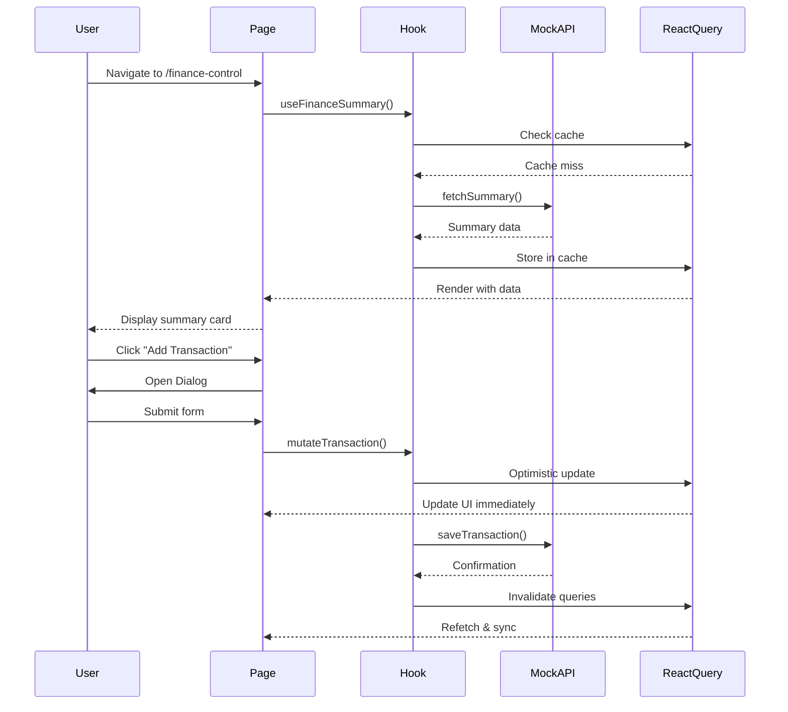

# Design: finance-control-page

## 1. Overview

### 1.1 Design Goals
Create a visually stunning, dark-themed finance control interface that combines modern glassmorphism, gradient aesthetics, and functional data visualization. The design must feel premium while maintaining excellent usability and performance.

### 1.2 Visual Direction
Based on reference images provided:
- **Hero Card**: Layered cards with soft gradients (pink/purple tones) for account types, overlaying a dark textured card showing total balance with cryptocurrency equivalents
- **Subscription Calendar**: Minimalist monthly grid with colorful service icons positioned on billing dates, dark background with subtle borders
- **Overall Theme**: Dark base with strategic use of gradients, glassmorphism effects, and vibrant accent colors for CTAs

## 2. Architecture Overview

### 2.1 High-Level Architecture

```mermaid
graph TB
    A[finance-control/page.tsx] --> B[FinanceSummaryCard]
    A --> C[TransactionList]
    A --> D[PendingTasksPanel]
    A --> E[QuickActions]
    
    B --> F[useFinanceSummary Hook]
    C --> G[useFinanceTransactions Hook]
    D --> H[useFinancePendings Hook]
    
    F --> I[Mock Data Layer]
    G --> I
    H --> I
    
    B --> J[AccountTabs Component]
    B --> K[BalanceDisplay Component]
    B --> L[ActionButtons Component]
    
    C --> M[DataTable shadcn/ui]
    D --> N[Card shadcn/ui]
    
    style A fill:#1e293b
    style B fill:#7c3aed
    style C fill:#7c3aed
    style D fill:#7c3aed
    style E fill:#7c3aed
    style I fill:#059669
```



### 2.2 Component Hierarchy

```
Page (finance-control/page.tsx)
├── PageHeader
│   └── Title + Breadcrumb
├── Container (max-w-7xl mx-auto px-6)
│   ├── FinanceSummaryCard (Hero - Full Width)
│   │   ├── AccountTabs (Layered cards: Funding, Trading, etc.)
│   │   ├── BalanceDisplay (Total balance + crypto equivalent)
│   │   └── ActionButtons (Deposit, Withdraw, Transfer, History)
│   ├── Grid (lg:grid-cols-2 gap-6)
│   │   ├── TransactionList
│   │   │   ├── FilterBar (Date, Type, Tags)
│   │   │   └── DataTable (Paginated transactions)
│   │   └── PendingTasksPanel
│   │       ├── PendingCard[] (Stacked items)
│   │       └── QuickActions (Create buttons)
└── (Future) Grid for Subscriptions + Credit Cards
```

### 2.3 Data Flow



## 3. Component Design Specifications

### 3.1 FinanceSummaryCard

**File**: `frontend/src/components/finance/finance-summary-card.tsx`

**Responsibilities**:
- Display layered account cards (Funding, Trading) with gradients
- Show total balance prominently with large typography
- Display cryptocurrency equivalent (e.g., BTC)
- Provide quick action buttons (Deposit, Withdraw)

**Visual Specification**:
```
┌─────────────────────────────────────────────────────────────┐
│ ┌─────────────────────────────────────────────────────────┐ │
│ │ 💳 Funding                           $243,940.03        │ │ ← Pink gradient
│ │ ┌───────────────────────────────────────────────────┐   │ │
│ │ │ 📊 Unified Trading                 $310,495.50    │   │ │ ← Purple gradient
│ │ │ ┌─────────────────────────────────────────────┐   │   │ │
│ │ │ │ ⚪ Total Balance                    🔄      │   │   │ │ ← Dark textured
│ │ │ │                                              │   │   │ │
│ │ │ │ $534,435.53                                  │   │   │ │ ← Large white text
│ │ │ │ ₿ 9.300554 BTC                               │   │   │ │ ← Orange accent
│ │ │ │                                              │   │   │ │
│ │ │ └─────────────────────────────────────────────┘   │   │ │
│ │ └───────────────────────────────────────────────────┘   │ │
│ └─────────────────────────────────────────────────────────┘ │
│                                                               │
│ [🔻 Deposit]  [🔺 Withdraw]  [↔️ Transfer]  [🕐 History]     │ ← Action buttons
└─────────────────────────────────────────────────────────────┘
```

**Props Interface**:
```typescript
interface FinanceSummaryCardProps {
  summary: FinancialSummary;
  onDeposit: () => void;
  onWithdraw: () => void;
  onTransfer?: () => void;
  isLoading?: boolean;
}
```

**Styling Notes**:
- Use `backdrop-blur-md` for glassmorphism on account cards
- Gradients: `bg-gradient-to-br from-pink-400/20 to-pink-600/20` (Funding), `from-purple-400/20 to-purple-600/20` (Trading)
- Main card: `bg-card/50` with `shadow-2xl` and subtle texture via CSS or pseudo-element
- Typography: Balance should be `text-6xl font-bold`, crypto in `text-xl text-orange-400`

---

### 3.2 TransactionList

**File**: `frontend/src/components/finance/transaction-list.tsx`

**Responsibilities**:
- Display paginated or scrollable list of income/expense transactions
- Provide inline filtering (date range, type, tags)
- Show transaction status with color-coded badges
- Support row click to view details

**Visual Specification**:
```
┌─────────────────────────────────────────────────────────────┐
│ Recent Transactions                          [Filter ▾]     │
├─────────────────────────────────────────────────────────────┤
│ ┌─ Type ─┬─ Description ─────┬─ Amount ──┬─ Date ──┬─ Status ┐
│ │ 🟢 IN  │ Salary Payment    │ +$5,000  │ Oct 25  │ ✓ Done   │
│ │ 🔴 OUT │ Rent              │ -$1,200  │ Oct 24  │ ✓ Done   │
│ │ 🔴 OUT │ Groceries         │ -$150    │ Oct 23  │ ⏳ Pending│
│ └────────┴───────────────────┴──────────┴─────────┴─────────┘
│                                                               │
│                                    [← Previous] [Next →]     │
└─────────────────────────────────────────────────────────────┘
```

**Props Interface**:
```typescript
interface TransactionListProps {
  filters?: {
    dateRange?: { start: Date; end: Date };
    type?: 'INCOME' | 'EXPENSE' | 'ALL';
    tags?: string[];
  };
  onFilterChange?: (filters: TransactionFilters) => void;
  onRowClick?: (transaction: Transaction) => void;
}
```

**Dependencies**:
- Reuses `DataTable` component from `@/components/ui/data-table`
- Uses `Badge` for status indicators
- Uses `ScrollArea` if list exceeds viewport height

---

### 3.3 PendingTasksPanel

**File**: `frontend/src/components/finance/pending-tasks-panel.tsx`

**Responsibilities**:
- Display upcoming bills/payments sorted by due date
- Highlight overdue items with visual urgency (red border, pulsing badge)
- Provide "Mark as Paid" action
- Show recurrence indicators (monthly, yearly icons)

**Visual Specification**:
```
┌─────────────────────────────────────────────┐
│ Pending Payments          [+ New Payment]   │
├─────────────────────────────────────────────┤
│ ┌─────────────────────────────────────────┐ │
│ │ ⚠️ Internet Bill          $79.99        │ │ ← Overdue (red border)
│ │ Due: Oct 20 (5 days ago)  🔁 Monthly    │ │
│ │                      [✓ Mark as Paid]   │ │
│ └─────────────────────────────────────────┘ │
│ ┌─────────────────────────────────────────┐ │
│ │ 📱 Phone Bill             $45.00        │ │ ← Upcoming (normal)
│ │ Due: Oct 28 (3 days)      🔁 Monthly    │ │
│ │                      [✓ Mark as Paid]   │ │
│ └─────────────────────────────────────────┘ │
│ ┌─────────────────────────────────────────┐ │
│ │ 💡 Electricity            $120.50       │ │
│ │ Due: Nov 5 (11 days)      🔁 Monthly    │ │
│ │                      [✓ Mark as Paid]   │ │
│ └─────────────────────────────────────────┘ │
└─────────────────────────────────────────────┘
```

**Props Interface**:
```typescript
interface PendingTasksPanelProps {
  pendings: PendingPayment[];
  onMarkPaid: (id: string) => Promise<void>;
  onCreateNew: () => void;
}
```

**Styling Notes**:
- Cards use `border-l-4` with color based on urgency: `border-red-500` (overdue), `border-yellow-500` (due soon), `border-muted` (normal)
- Animate overdue cards with subtle `animate-pulse` on the border
- Use `Accordion` if list grows beyond 5-6 items

---

### 3.4 SubscriptionsCalendar (Phase 3)

**File**: `frontend/src/components/finance/subscriptions-calendar.tsx`

**Responsibilities**:
- Render monthly calendar grid with subscription icons on billing dates
- Display monthly spending total
- Support click to view subscription details/history

**Visual Specification** (from reference image):
```
┌─────────────────────────────────────────────────────────┐
│ LN 2024                       Monthly spend: €43.72     │
├─────────────────────────────────────────────────────────┤
│  SUN   MON   TUE   WED   THU   FRI   SAT                │
│  ▢     ▢     ▢     01🔵  02🟣  03     04                 │
│  05    06    07🔴  08    09    10     11🟢               │
│  12🎧  13    14    15🟢  16    17     18                 │
│  19    20    21    22    23    24🔵   25                 │
│  26    27🟣  28    29    30🟠  31                        │
└─────────────────────────────────────────────────────────┘

Legend: 🔴 Netflix  🟢 Spotify  🔵 LinkedIn  🟣 Notion  🟠 Amazon
```

**Props Interface**:
```typescript
interface SubscriptionsCalendarProps {
  month: Date;
  subscriptions: Subscription[];
  onDayClick: (date: Date, subscriptions: Subscription[]) => void;
  onMonthChange: (newMonth: Date) => void;
}
```

**Implementation Notes**:
- Extend `@/components/ui/calendar` with custom day rendering
- Use `Avatar` or `Image` components for service icons
- Store icon mappings in `src/lib/constants/subscription-icons.ts`

---

### 3.5 CreditCardStack (Phase 4)

**File**: `frontend/src/components/finance/credit-card-stack.tsx`

**Responsibilities**:
- Display credit card visualizations with gradients matching card themes
- Show limit utilization via `Progress` component
- Provide hover effects (3D tilt using `framer-motion` or CSS transforms)

**Visual Specification**:
```
┌─────────────────────────────────────────────┐
│ My Credit Cards                             │
├─────────────────────────────────────────────┤
│ ┌─────────────────────────────────────────┐ │
│ │ 💳 Visa Platinum                        │ │ ← Blue-purple gradient
│ │                                         │ │
│ │ ████████████░░░░                        │ │ ← Progress (80%)
│ │ $4,000 / $5,000                         │ │
│ │                                         │ │
│ │ Due: Nov 15        [View Statement]    │ │
│ └─────────────────────────────────────────┘ │
│ ┌─────────────────────────────────────────┐ │
│ │ 💳 Mastercard Gold                      │ │ ← Gold gradient
│ │ ...                                     │ │
│ └─────────────────────────────────────────┘ │
└─────────────────────────────────────────────┘
```

**Props Interface**:
```typescript
interface CreditCardStackProps {
  cards: CreditCard[];
  onViewStatement: (cardId: string) => void;
  onManageCard: (cardId: string) => void;
}
```

**Styling Notes**:
- Use `transform-gpu` for performance on 3D effects
- Gradient examples: `bg-gradient-to-br from-blue-500 to-purple-600` (Visa), `from-yellow-500 to-orange-600` (Mastercard)

---

### 3.6 QuickActions

**File**: `frontend/src/components/finance/quick-actions.tsx`

**Responsibilities**:
- Floating action button or button group to trigger creation modals
- Open `Dialog` with forms for adding transactions, pendings, subscriptions, cards

**Visual Specification**:
```
┌─────────────────────────────────────────────┐
│ Quick Actions                               │
├─────────────────────────────────────────────┤
│ [➕ Add Transaction] [📅 Add Pending]       │
│ [🔁 Add Subscription] [💳 Add Card]         │
└─────────────────────────────────────────────┘
```

**Props Interface**:
```typescript
interface QuickActionsProps {
  onAddTransaction: () => void;
  onAddPending: () => void;
  onAddSubscription?: () => void; // Phase 3
  onAddCard?: () => void; // Phase 4
}
```

**Implementation Notes**:
- Buttons use `variant="default"` with gradient backgrounds via Tailwind
- Dialog forms use `react-hook-form` + `zod` validation
- On submit, optimistically update React Query cache before API call

---

## 4. Data Models

### 4.1 TypeScript Interfaces

**File**: `frontend/src/lib/types/finance.ts`

```typescript
// Core Types
export type TransactionType = 'INCOME' | 'EXPENSE';
export type TransactionStatus = 'COMPLETED' | 'PENDING' | 'CANCELLED';
export type AccountType = 'FUNDING' | 'TRADING' | 'SAVINGS';
export type Recurrence = 'ONCE' | 'WEEKLY' | 'MONTHLY' | 'YEARLY';
export type Priority = 'LOW' | 'MEDIUM' | 'HIGH';
export type PendingStatus = 'PENDING' | 'OVERDUE' | 'PAID';

// Financial Summary
export interface FinancialSummary {
  totalBalance: number;
  currency: string;
  cryptoEquivalent?: {
    symbol: string; // e.g., "BTC"
    amount: number;
    icon?: string;
  };
  accounts: Account[];
  variation: {
    amount: number;
    percentage: number;
    period: 'DAILY' | 'WEEKLY' | 'MONTHLY';
  };
  lastUpdated: Date;
}

export interface Account {
  id: string;
  name: string;
  type: AccountType;
  balance: number;
  currency: string;
  color?: string; // For gradient theming
}

// Transaction
export interface Transaction {
  id: string;
  type: TransactionType;
  category: string;
  description: string;
  amount: number;
  date: Date;
  accountId: string;
  tags: string[];
  status: TransactionStatus;
  notes?: string;
  createdAt: Date;
  updatedAt: Date;
}

// Pending Payment
export interface PendingPayment {
  id: string;
  description: string;
  amount: number;
  currency: string;
  dueDate: Date;
  recurrence: Recurrence;
  priority: Priority;
  status: PendingStatus;
  categoryId: string;
  accountId: string;
  notes?: string;
  createdAt: Date;
  updatedAt: Date;
}

// Subscription (Phase 3)
export interface Subscription {
  id: string;
  serviceName: string;
  amount: number;
  currency: string;
  billingDay: number; // 1-31
  icon?: string; // URL or identifier for icon
  category: string;
  status: 'ACTIVE' | 'PAUSED' | 'CANCELLED';
  startDate: Date;
  nextBilling: Date;
  paymentHistory?: SubscriptionPayment[];
}

export interface SubscriptionPayment {
  id: string;
  date: Date;
  amount: number;
  status: 'SUCCESS' | 'FAILED' | 'PENDING';
}

// Credit Card (Phase 4)
export interface CreditCard {
  id: string;
  nickname: string;
  brand: 'VISA' | 'MASTERCARD' | 'AMEX' | 'DISCOVER';
  lastFour: string;
  totalLimit: number;
  availableLimit: number;
  currentBalance: number;
  dueDate: Date;
  minimumPayment: number;
  themeColor: string; // Hex color for gradient
  status: 'ACTIVE' | 'BLOCKED' | 'EXPIRED';
}
```

### 4.2 Mock Data Generator

**File**: `frontend/src/lib/mocks/finance-data.ts`

```typescript
import { faker } from '@faker-js/faker';
import {
  Transaction,
  PendingPayment,
  FinancialSummary,
  Account,
} from '@/lib/types/finance';

export function generateMockSummary(): FinancialSummary {
  const fundingBalance = faker.number.float({ min: 100000, max: 300000, fractionDigits: 2 });
  const tradingBalance = faker.number.float({ min: 200000, max: 400000, fractionDigits: 2 });
  const totalBalance = fundingBalance + tradingBalance;

  return {
    totalBalance,
    currency: 'USD',
    cryptoEquivalent: {
      symbol: 'BTC',
      amount: totalBalance / 57000, // Mock BTC price
      icon: '₿',
    },
    accounts: [
      {
        id: 'acc-1',
        name: 'Funding',
        type: 'FUNDING',
        balance: fundingBalance,
        currency: 'USD',
        color: 'from-pink-400 to-pink-600',
      },
      {
        id: 'acc-2',
        name: 'Unified Trading',
        type: 'TRADING',
        balance: tradingBalance,
        currency: 'USD',
        color: 'from-purple-400 to-purple-600',
      },
    ],
    variation: {
      amount: faker.number.float({ min: -5000, max: 5000, fractionDigits: 2 }),
      percentage: faker.number.float({ min: -5, max: 5, fractionDigits: 2 }),
      period: 'MONTHLY',
    },
    lastUpdated: new Date(),
  };
}

export function generateMockTransactions(count: number = 20): Transaction[] {
  return Array.from({ length: count }, (_, i) => ({
    id: `txn-${i + 1}`,
    type: faker.helpers.arrayElement(['INCOME', 'EXPENSE']),
    category: faker.helpers.arrayElement(['Salary', 'Rent', 'Groceries', 'Transport', 'Entertainment']),
    description: faker.finance.transactionDescription(),
    amount: faker.number.float({ min: 10, max: 5000, fractionDigits: 2 }),
    date: faker.date.recent({ days: 30 }),
    accountId: faker.helpers.arrayElement(['acc-1', 'acc-2']),
    tags: faker.helpers.arrayElements(['essential', 'discretionary', 'investment'], { min: 0, max: 2 }),
    status: faker.helpers.arrayElement(['COMPLETED', 'PENDING']),
    createdAt: faker.date.recent({ days: 30 }),
    updatedAt: faker.date.recent({ days: 30 }),
  }));
}

export function generateMockPendings(count: number = 5): PendingPayment[] {
  return Array.from({ length: count }, (_, i) => {
    const dueDate = faker.date.soon({ days: 15 });
    const isPastDue = dueDate < new Date();
    
    return {
      id: `pnd-${i + 1}`,
      description: faker.helpers.arrayElement(['Internet Bill', 'Phone Bill', 'Electricity', 'Water', 'Insurance']),
      amount: faker.number.float({ min: 30, max: 200, fractionDigits: 2 }),
      currency: 'USD',
      dueDate,
      recurrence: 'MONTHLY',
      priority: isPastDue ? 'HIGH' : faker.helpers.arrayElement(['LOW', 'MEDIUM']),
      status: isPastDue ? 'OVERDUE' : 'PENDING',
      categoryId: 'cat-utilities',
      accountId: 'acc-1',
      createdAt: faker.date.recent({ days: 60 }),
      updatedAt: faker.date.recent({ days: 30 }),
    };
  });
}
```

---

## 5. Hooks Architecture

### 5.1 useFinanceSummary

**File**: `frontend/src/hooks/use-finance-summary.ts`

```typescript
import { useQuery, useMutation, useQueryClient } from '@tanstack/react-query';
import { generateMockSummary } from '@/lib/mocks/finance-data';
import { FinancialSummary } from '@/lib/types/finance';

const QUERY_KEY = ['finance', 'summary'];

export function useFinanceSummary() {
  return useQuery<FinancialSummary>({
    queryKey: QUERY_KEY,
    queryFn: async () => {
      // Simulate API delay
      await new Promise(resolve => setTimeout(resolve, 800));
      return generateMockSummary();
    },
    staleTime: 5 * 60 * 1000, // 5 minutes
    gcTime: 10 * 60 * 1000, // 10 minutes (formerly cacheTime)
  });
}

// Future: Add mutation for updating account balances
export function useUpdateBalance() {
  const queryClient = useQueryClient();
  
  return useMutation({
    mutationFn: async (data: { accountId: string; amount: number }) => {
      // Mock API call
      await new Promise(resolve => setTimeout(resolve, 500));
      return data;
    },
    onSuccess: () => {
      queryClient.invalidateQueries({ queryKey: QUERY_KEY });
    },
  });
}
```

### 5.2 useFinanceTransactions

**File**: `frontend/src/hooks/use-finance-transactions.ts`

```typescript
import { useQuery, useMutation, useQueryClient } from '@tanstack/react-query';
import { generateMockTransactions } from '@/lib/mocks/finance-data';
import { Transaction } from '@/lib/types/finance';

interface TransactionFilters {
  dateRange?: { start: Date; end: Date };
  type?: 'INCOME' | 'EXPENSE' | 'ALL';
  tags?: string[];
}

export function useFinanceTransactions(filters?: TransactionFilters) {
  return useQuery<Transaction[]>({
    queryKey: ['finance', 'transactions', filters],
    queryFn: async () => {
      await new Promise(resolve => setTimeout(resolve, 600));
      let transactions = generateMockTransactions(50);
      
      // Apply filters
      if (filters?.type && filters.type !== 'ALL') {
        transactions = transactions.filter(t => t.type === filters.type);
      }
      if (filters?.dateRange) {
        transactions = transactions.filter(t => 
          t.date >= filters.dateRange!.start && t.date <= filters.dateRange!.end
        );
      }
      
      return transactions.sort((a, b) => b.date.getTime() - a.date.getTime());
    },
    staleTime: 2 * 60 * 1000,
  });
}

export function useCreateTransaction() {
  const queryClient = useQueryClient();
  
  return useMutation({
    mutationFn: async (data: Omit<Transaction, 'id' | 'createdAt' | 'updatedAt'>) => {
      await new Promise(resolve => setTimeout(resolve, 400));
      return { ...data, id: `txn-${Date.now()}`, createdAt: new Date(), updatedAt: new Date() };
    },
    onMutate: async (newTransaction) => {
      // Optimistic update
      await queryClient.cancelQueries({ queryKey: ['finance', 'transactions'] });
      const previousTransactions = queryClient.getQueryData(['finance', 'transactions']);
      
      queryClient.setQueryData(['finance', 'transactions'], (old: Transaction[] | undefined) => 
        old ? [{ ...newTransaction, id: 'temp', createdAt: new Date(), updatedAt: new Date() }, ...old] : []
      );
      
      return { previousTransactions };
    },
    onError: (err, newTransaction, context) => {
      queryClient.setQueryData(['finance', 'transactions'], context?.previousTransactions);
    },
    onSettled: () => {
      queryClient.invalidateQueries({ queryKey: ['finance', 'transactions'] });
      queryClient.invalidateQueries({ queryKey: ['finance', 'summary'] });
    },
  });
}
```

### 5.3 useFinancePendings

**File**: `frontend/src/hooks/use-finance-pendings.ts`

```typescript
import { useQuery, useMutation, useQueryClient } from '@tanstack/react-query';
import { generateMockPendings } from '@/lib/mocks/finance-data';
import { PendingPayment } from '@/lib/types/finance';

export function useFinancePendings() {
  return useQuery<PendingPayment[]>({
    queryKey: ['finance', 'pendings'],
    queryFn: async () => {
      await new Promise(resolve => setTimeout(resolve, 500));
      return generateMockPendings(8).sort((a, b) => a.dueDate.getTime() - b.dueDate.getTime());
    },
    staleTime: 60 * 1000,
  });
}

export function useMarkPendingPaid() {
  const queryClient = useQueryClient();
  
  return useMutation({
    mutationFn: async (pendingId: string) => {
      await new Promise(resolve => setTimeout(resolve, 300));
      return pendingId;
    },
    onSuccess: () => {
      queryClient.invalidateQueries({ queryKey: ['finance', 'pendings'] });
      queryClient.invalidateQueries({ queryKey: ['finance', 'transactions'] });
      queryClient.invalidateQueries({ queryKey: ['finance', 'summary'] });
    },
  });
}
```

---

## 6. Page Layout Implementation

### 6.1 Route Structure

**File**: `frontend/src/app/(dashboard)/finance-control/page.tsx`

```typescript
import { Suspense } from 'react';
import { PageHeader } from '@/components/page-header';
import { FinanceSummaryCard } from '@/components/finance/finance-summary-card';
import { TransactionList } from '@/components/finance/transaction-list';
import { PendingTasksPanel } from '@/components/finance/pending-tasks-panel';
import { Skeleton } from '@/components/ui/skeleton';

export default function FinanceControlPage() {
  return (
    <div className="flex flex-col gap-6">
      <PageHeader
        title="Finance Control"
        description="Manage your financial overview, transactions, and pending payments"
      />
      
      <div className="container mx-auto max-w-7xl px-6">
        {/* Hero Section */}
        <Suspense fallback={<Skeleton className="h-64 w-full" />}>
          <FinanceSummaryCard />
        </Suspense>
        
        {/* Main Grid */}
        <div className="mt-8 grid gap-6 lg:grid-cols-2">
          <Suspense fallback={<Skeleton className="h-96" />}>
            <TransactionList />
          </Suspense>
          
          <Suspense fallback={<Skeleton className="h-96" />}>
            <PendingTasksPanel />
          </Suspense>
        </div>
      </div>
    </div>
  );
}
```

### 6.2 Responsive Breakpoints

| Breakpoint | Layout | Adjustments |
| --- | --- | --- |
| `< 768px` (mobile) | Single column | Stack all components vertically, reduce card padding, touch-optimized buttons (min 44px tap target) |
| `768px - 1024px` (tablet) | Single column with larger cards | Maintain stacking but increase spacing, larger text for readability |
| `> 1024px` (desktop) | 2-column grid | Full layout as designed, side-by-side components |

---

## 7. Styling & Theme Integration

### 7.1 Color Palette Extensions

Add to `frontend/src/app/globals.css`:

```css
@layer base {
  :root {
    /* Finance-specific colors */
    --finance-income: 142 76% 36%; /* Green for income */
    --finance-expense: 0 84% 60%; /* Red for expenses */
    --finance-pending: 45 93% 47%; /* Yellow for pending */
    
    /* Card gradients */
    --gradient-funding: linear-gradient(135deg, hsl(330 50% 70%) 0%, hsl(330 50% 50%) 100%);
    --gradient-trading: linear-gradient(135deg, hsl(270 50% 70%) 0%, hsl(270 50% 50%) 100%);
  }
  
  .dark {
    --finance-income: 142 71% 45%;
    --finance-expense: 0 72% 51%;
    --finance-pending: 45 93% 54%;
  }
}

@layer utilities {
  .card-finance-hero {
    background: radial-gradient(ellipse at top, hsl(var(--card)) 0%, hsl(var(--background)) 100%);
    backdrop-filter: blur(12px);
  }
  
  .text-balance-primary {
    @apply text-6xl font-bold tracking-tight;
  }
  
  .text-balance-crypto {
    @apply text-xl text-orange-400 font-medium;
  }
}
```

### 7.2 Animation Classes

```css
@keyframes pulse-border {
  0%, 100% {
    border-color: hsl(var(--finance-expense));
    opacity: 1;
  }
  50% {
    border-color: hsl(var(--finance-expense) / 0.5);
    opacity: 0.7;
  }
}

.animate-pulse-border {
  animation: pulse-border 2s cubic-bezier(0.4, 0, 0.6, 1) infinite;
}
```

---

## 8. Error Handling & Edge Cases

### 8.1 Loading States

All components must implement skeleton loaders:
- FinanceSummaryCard: Multi-layered skeleton matching card structure
- TransactionList: 5-row skeleton table
- PendingTasksPanel: 3 card skeletons with pulsing animation

### 8.2 Empty States

**No Transactions**:
```tsx
<div className="flex flex-col items-center justify-center py-12">
  <p className="text-muted-foreground">No transactions yet</p>
  <Button onClick={onAddTransaction} className="mt-4">
    Add Your First Transaction
  </Button>
</div>
```

**No Pending Payments**:
```tsx
<div className="text-center text-muted-foreground">
  All caught up! No pending payments.
</div>
```

### 8.3 Error Boundaries

Wrap page in ErrorBoundary component:
```tsx
<ErrorBoundary fallback={<FinanceErrorFallback />}>
  <FinanceControlPage />
</ErrorBoundary>
```

---

## 9. Testing Strategy

### 9.1 Component Tests

**Priority Components**:
1. FinanceSummaryCard: Test balance calculations, account switching, crypto conversion
2. TransactionList: Test filtering, sorting, pagination
3. PendingTasksPanel: Test "mark as paid" mutation, overdue highlighting

**Test Framework**: Vitest + React Testing Library

### 9.2 Integration Tests

**Critical Flows**:
1. **Create Transaction**: Open modal → fill form → submit → verify list update
2. **Mark Pending Paid**: Click button → optimistic update → verify cache invalidation
3. **Filter Transactions**: Apply date filter → verify query params update → verify filtered results

### 9.3 Visual Regression Tests

Use Playwright for:
- Snapshot of FinanceSummaryCard in light/dark mode
- Snapshot of transaction list with various states (loading, empty, populated)
- Responsive layout checks at 3 breakpoints

---

## 10. Performance Optimization

### 10.1 Code Splitting

```typescript
// Lazy load modals only when needed
const TransactionModal = lazy(() => import('@/components/finance/transaction-modal'));
const PendingModal = lazy(() => import('@/components/finance/pending-modal'));
```

### 10.2 React Query Configuration

```typescript
// In providers.tsx or dedicated finance query client
const queryClient = new QueryClient({
  defaultOptions: {
    queries: {
      staleTime: 2 * 60 * 1000, // 2 minutes
      gcTime: 10 * 60 * 1000,
      retry: 1,
      refetchOnWindowFocus: false,
    },
  },
});
```

### 10.3 Virtualization

If transaction list exceeds 100 items, implement virtualization:
```typescript
import { useVirtualizer } from '@tanstack/react-virtual';

// Inside TransactionList component
const rowVirtualizer = useVirtualizer({
  count: transactions.length,
  getScrollElement: () => scrollRef.current,
  estimateSize: () => 50, // row height
  overscan: 5,
});
```

---

## 11. Accessibility Requirements

### 11.1 Keyboard Navigation

- All interactive elements must be keyboard-accessible (Tab, Enter, Escape)
- Modal dialogs must trap focus and restore focus on close
- Dropdown filters must support arrow key navigation

### 11.2 ARIA Labels

```tsx
<button
  aria-label="Mark Internet Bill as paid"
  onClick={() => onMarkPaid(pending.id)}
>
  <CheckIcon />
</button>

<input
  type="number"
  aria-label="Transaction amount in USD"
  aria-describedby="amount-help-text"
/>
```

### 11.3 Color Contrast

- All text must meet WCAG AA standards (4.5:1 for normal text, 3:1 for large text)
- Status indicators must not rely on color alone (use icons + text)

---

## 12. Migration Path to Supabase (Phase 2)

### 12.1 Database Schema (Future)

```sql
-- Accounts table
CREATE TABLE accounts (
  id UUID PRIMARY KEY DEFAULT uuid_generate_v4(),
  user_id UUID REFERENCES auth.users(id),
  name TEXT NOT NULL,
  type TEXT CHECK (type IN ('FUNDING', 'TRADING', 'SAVINGS')),
  balance NUMERIC(12, 2) NOT NULL DEFAULT 0,
  currency TEXT DEFAULT 'USD',
  created_at TIMESTAMPTZ DEFAULT NOW()
);

-- Transactions table
CREATE TABLE transactions (
  id UUID PRIMARY KEY DEFAULT uuid_generate_v4(),
  user_id UUID REFERENCES auth.users(id),
  account_id UUID REFERENCES accounts(id),
  type TEXT CHECK (type IN ('INCOME', 'EXPENSE')),
  category TEXT NOT NULL,
  description TEXT,
  amount NUMERIC(12, 2) NOT NULL,
  transaction_date DATE NOT NULL,
  tags TEXT[],
  status TEXT DEFAULT 'COMPLETED',
  created_at TIMESTAMPTZ DEFAULT NOW(),
  updated_at TIMESTAMPTZ DEFAULT NOW()
);

-- Pending payments table
CREATE TABLE pending_payments (
  id UUID PRIMARY KEY DEFAULT uuid_generate_v4(),
  user_id UUID REFERENCES auth.users(id),
  description TEXT NOT NULL,
  amount NUMERIC(12, 2) NOT NULL,
  due_date DATE NOT NULL,
  recurrence TEXT DEFAULT 'ONCE',
  priority TEXT DEFAULT 'MEDIUM',
  status TEXT DEFAULT 'PENDING',
  created_at TIMESTAMPTZ DEFAULT NOW()
);
```

### 12.2 API Routes

Create Next.js API routes in `frontend/src/app/api/finance/`:
- `GET /api/finance/summary` → Fetch aggregated summary
- `GET /api/finance/transactions` → Fetch transactions with filters
- `POST /api/finance/transactions` → Create transaction
- `PATCH /api/finance/pendings/:id` → Update pending status

### 12.3 Hook Migration Strategy

1. Keep mock hooks alongside real hooks initially
2. Add feature flag to toggle between mock/real data sources
3. Gradually migrate component by component after UI validation

---

## 13. Security Considerations

### 13.1 Input Validation

All forms must validate using Zod schemas:
```typescript
import { z } from 'zod';

export const transactionSchema = z.object({
  type: z.enum(['INCOME', 'EXPENSE']),
  amount: z.number().positive().max(1000000),
  category: z.string().min(1).max(100),
  description: z.string().max(500),
  date: z.date(),
  tags: z.array(z.string()).max(10),
});
```

### 13.2 Data Sanitization

- Sanitize user inputs before display (use DOMPurify if rendering HTML)
- Escape SQL queries when integrating Supabase (use parameterized queries)

### 13.3 Authentication

- Verify user authentication in API routes using middleware
- Ensure row-level security (RLS) policies in Supabase tables

---

## 14. Deployment Checklist

Before production:
- [ ] All components render without console errors
- [ ] Lighthouse performance score > 90
- [ ] Accessibility audit passes (axe DevTools)
- [ ] Cross-browser testing complete (Chrome, Firefox, Safari, Edge)
- [ ] Mobile responsive verified on iOS/Android devices
- [ ] Mock data replaced with production data source
- [ ] Error boundaries tested with forced errors
- [ ] Loading states verified with throttled network
- [ ] Empty states tested by clearing data
- [ ] Analytics events configured (PostHog/equivalent)

---

## 15. Documentation Requirements

Create user-facing documentation:
- **User Guide**: How to use finance control features
- **FAQ**: Common questions about transactions, pendings, etc.
- **Keyboard Shortcuts**: Document any keyboard shortcuts added

Create developer documentation:
- **Component Storybook**: Visual documentation of all finance components
- **API Documentation**: Document hook signatures and return types
- **Design System**: Document custom color classes and utilities added