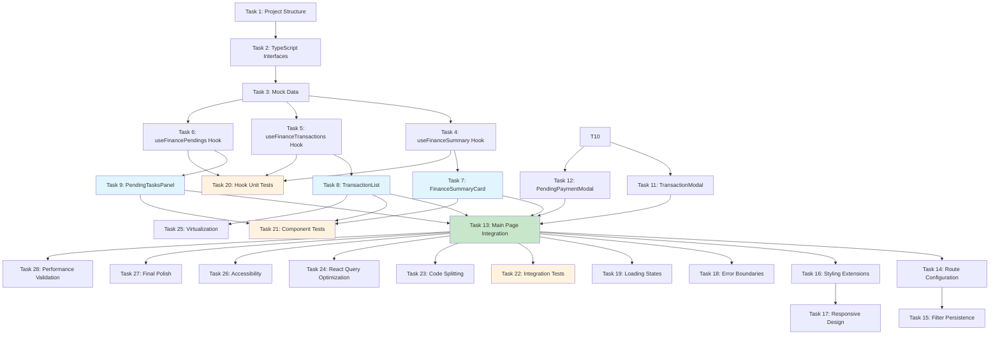

# Tasks: finance-control-page

## Phase 1: Foundation Setup

- [ ] 1. Create project structure and core directories
  - Create directories for finance components, hooks, types, and utilities
  - Set up barrel exports for clean imports
  - _Requirements: TR-5, TR-6, TR-7_

- [ ] 2. Define TypeScript interfaces and types
  - Create Transaction, PendingPayment, FinancialSummary interfaces
  - Define enums for TransactionType, TransactionStatus, AccountType, Recurrence, Priority, PendingStatus
  - Add proper type exports and documentation
  - _Requirements: TR-10, TR-11, TR-12_

- [ ] 3. Set up mock data generators
  - Implement generateMockSummary() function with realistic data
  - Implement generateMockTransactions() with diverse transaction types
  - Implement generateMockPendings() with various due dates and priorities
  - Add data validation and type safety checks
  - _Requirements: TR-9_

## Phase 2: Core Hooks Implementation

- [ ] 4. Implement useFinanceSummary hook
  - Create useFinanceSummary() with React Query integration
  - Add proper query key management and cache configuration
  - Implement useUpdateBalance() mutation for optimistic updates
  - Add error handling and loading states
  - _Requirements: TR-13, TR-1, TR-4_

- [ ] 5. Implement useFinanceTransactions hook
  - Create useFinanceTransactions() with filtering capabilities
  - Define TransactionFilters interface for date, type, and tag filtering
  - Implement useCreateTransaction() mutation with form validation
  - Add pagination and sorting support
  - _Requirements: TR-13, FR-2, TR-2_

- [ ] 6. Implement useFinancePendings hook
  - Create useFinancePendings() for pending payments management
  - Implement useMarkPendingPaid() mutation with status transitions
  - Add overdue detection and priority sorting
  - Include cache invalidation strategies
  - _Requirements: TR-13, FR-3_

## Phase 3: Core Component Development

- [ ] 7. Create FinanceSummaryCard component
  - Implement the hero card with total balance display
  - Add account type tabs (Funding, Trading, Savings)
  - Include quick action buttons (Deposit, Withdraw)
  - Add percentage variation with color coding
  - Implement responsive design and loading states
  - _Requirements: FR-1, TR-4, AC-1_

- [ ] 8. Create TransactionList component
  - Implement paginated/scrollable transaction list
  - Add transaction type indicators (INCOME/EXPENSE)
  - Include category badges and status indicators
  - Add filtering controls for date, type, and tags
  - Implement row click for detail view
  - Add empty states and loading skeletons
  - _Requirements: FR-2, AC-2, AC-5, TR-2_

- [ ] 9. Create PendingTasksPanel component
  - Implement pending payments cards ordered by due date
  - Add priority level indicators and overdue highlighting
  - Include mark as paid functionality with optimistic updates
  - Add recurrence status display
  - Implement responsive grid layout
  - _Requirements: FR-3, AC-4, AC-8_

## Phase 4: Quick Actions and Forms

- [ ] 10. Create QuickActions component
  - Implement floating action button with menu
  - Add options for Add Transaction, Add Payment, etc.
  - Include proper ARIA labels and keyboard navigation
  - Add animation and hover states
  - _Requirements: FR-6_

- [ ] 11. Create TransactionModal component
  - Implement form with type, amount, category, date fields
  - Add Zod schema validation for all inputs
  - Include proper error handling and field validation
  - Add success state with optimistic UI updates
  - Implement accessibility features
  - _Requirements: FR-6, AC-3, AC-7_

- [ ] 12. Create PendingPaymentModal component
  - Implement form for adding/editing pending payments
  - Add recurrence selection and priority settings
  - Include due date picker with validation
  - Add category selection and description fields
  - _Requirements: FR-6_

## Phase 5: Page Integration and Layout

- [ ] 13. Create main FinanceControlPage component
  - Implement responsive grid layout (2-column desktop, single mobile)
  - Integrate all components with proper spacing
  - Add page-level loading and error states
  - Implement smooth transitions between breakpoints
  - _Requirements: FR-8, AC-1, TR-1_

- [ ] 14. Add route configuration and navigation
  - Create /finance-control route in Next.js App Router
  - Add finance control item to sidebar navigation
  - Implement route highlighting and scroll preservation
  - Add proper meta tags and page titles
  - _Requirements: FR-7, DEP-6_

- [ ] 15. Implement filter persistence
  - Add URL parameter management for filters
  - Implement filter restoration on page return
  - Add browser history integration
  - Include proper debouncing for filter updates
  - _Requirements: AC-9_

## Phase 6: Styling and Theme Integration

- [ ] 16. Extend Tailwind CSS design tokens
  - Add finance-specific color palette extensions
  - Implement card-finance-hero and balance text classes
  - Add animation classes for pulse borders and transitions
  - Ensure dark mode compatibility
  - _Requirements: TR-6, 7.1, 7.2_

- [ ] 17. Implement responsive design system
  - Add breakpoint-specific styles for all components
  - Implement touch-optimized controls for mobile
  - Add proper spacing and typography scales
  - Ensure consistent visual hierarchy
  - _Requirements: FR-8, TR-4_

## Phase 7: Error Handling and Edge Cases

- [ ] 18. Implement comprehensive error boundaries
  - Add error boundary for the finance page
  - Create fallback UI for component failures
  - Add error reporting and logging
  - Include recovery mechanisms
  - _Requirements: 8.3_

- [ ] 19. Add loading and empty states
  - Implement skeleton loaders for all data components
  - Create meaningful empty state messages
  - Add call-to-action buttons for empty states
  - Include loading animations and transitions
  - _Requirements: TR-4, AC-6, 8.1, 8.2_

## Phase 8: Testing Implementation

- [ ] 20. Write unit tests for hooks
  - Test useFinanceSummary with mock data
  - Test useFinanceTransactions filtering logic
  - Test useFinancePendings mutations
  - Add React Query testing utilities
  - _Requirements: 9.1_

- [ ] 21. Write component tests
  - Test FinanceSummaryCard rendering and interactions
  - Test TransactionList filtering and pagination
  - Test PendingTasksPanel status updates
  - Add accessibility testing with axe
  - _Requirements: 9.1, 9.3_

- [ ] 22. Write integration tests
  - Test transaction creation flow end-to-end
  - Test pending payment completion flow
  - Test filter persistence across navigation
  - Add visual regression tests
  - _Requirements: AC-7, AC-8, AC-9, 9.2_

## Phase 9: Performance Optimization

- [ ] 23. Implement code splitting and lazy loading
  - Add dynamic imports for modal components
  - Implement route-level code splitting
  - Add proper loading boundaries
  - Optimize bundle size with tree shaking
  - _Requirements: 10.1, TR-1_

- [ ] 24. Optimize React Query configuration
  - Configure proper stale times and cache strategies
  - Implement background refetching
  - Add query cancellation on unmount
  - Optimize cache invalidation patterns
  - _Requirements: 10.2, TR-3_

- [ ] 25. Add virtualization for large lists
  - Implement react-window for transaction lists
  - Add proper row measurement and caching
  - Include smooth scrolling behavior
  - Test performance with 1000+ items
  - _Requirements: 10.3, TR-2_

## Phase 10: Accessibility and Final Polish

- [ ] 26. Implement comprehensive accessibility
  - Add keyboard navigation for all interactive elements
  - Include proper ARIA labels and descriptions
  - Ensure color contrast compliance (WCAG AA)
  - Add screen reader support for dynamic content
  - _Requirements: 11.1, 11.2, 11.3, SM-5_

- [ ] 27. Add final polish and animations
  - Implement micro-interactions and hover states
  - Add smooth transitions and animations
  - Include loading spinners and progress indicators
  - Ensure consistent animation timing
  - _Requirements: 7.2_

- [ ] 28. Performance validation and optimization
  - Run Lighthouse performance audits
  - Optimize Core Web Vitals (LCP, FID, CLS)
  - Test on various network conditions
  - Validate 2-second page load requirement
  - _Requirements: SM-1, SM-4, TR-1_

## Dependencies Graph

## Total Tasks: 28
**Estimated Time**: 40-50 hours
**Success Metrics**: All acceptance criteria met, performance targets achieved, accessibility compliance verified

## Agent Assignments

**Claude**: Tasks 1-7, 13-15, 20-22, 28 (Core architecture, integration, testing, validation)
**Droid**: Tasks 8-12, 16-19, 23-27 (UI components, styling, optimization, accessibility)
**Codex**: Tasks 4-6, 25 (Complex hooks, performance-critical components)
<!-- ORCHESTRATOR-TASKS-SYNC START -->
## Orchestrator Task Status

- [x] **1** — Task 1
  - Status: completed
  - Atualizado: 2025-10-28T03:14:00.842278+00:00
  - Assistente: Droid (terminal f8271762-4e62-4620-b3eb-79c73d7d871b) — comando: droid -- "Execute tasks 1-4 for finance-control-page feature: Task 1: Create project structure and core directories - Cr...
- [x] **10** — Task 10
  - Status: completed
  - Atualizado: 2025-10-28T03:39:28.052372+00:00
  - Assistente: Droid
- [x] **11** — Task 11
  - Status: completed
  - Atualizado: 2025-10-28T03:39:30.206640+00:00
  - Assistente: Droid
- [x] **12** — Task 12
  - Status: completed
  - Atualizado: 2025-10-28T03:39:32.047559+00:00
  - Assistente: Droid
- [x] **13** — Task 13
  - Status: completed
  - Atualizado: 2025-10-28T03:39:45.132005+00:00
  - Assistente: Droid
- [x] **14** — Task 14
  - Status: completed
  - Atualizado: 2025-10-28T03:39:46.380690+00:00
  - Assistente: Droid
- [x] **15** — Task 15
  - Status: completed
  - Atualizado: 2025-10-28T03:39:47.672162+00:00
  - Assistente: Droid
- [x] **16** — Task 16
  - Status: completed
  - Atualizado: 2025-10-28T03:39:48.830658+00:00
  - Assistente: Droid
- [x] **17** — Task 17
  - Status: completed
  - Atualizado: 2025-10-28T03:39:50.273673+00:00
  - Assistente: Droid
- [x] **18** — Task 18
  - Status: completed
  - Atualizado: 2025-10-28T03:39:51.438897+00:00
  - Assistente: Droid
- [x] **19** — Task 19
  - Status: completed
  - Atualizado: 2025-10-28T03:39:52.630502+00:00
  - Assistente: Droid
- [x] **2** — Task 2
  - Status: completed
  - Atualizado: 2025-10-28T03:14:02.935532+00:00
  - Assistente: Droid
- [x] **20** — Task 20
  - Status: completed
  - Atualizado: 2025-10-28T03:39:54.472330+00:00
  - Assistente: Droid
- [x] **21** — Task 21
  - Status: completed
  - Atualizado: 2025-10-28T03:39:56.007083+00:00
  - Assistente: Droid
- [x] **22** — Task 22
  - Status: completed
  - Atualizado: 2025-10-28T03:39:57.382065+00:00
  - Assistente: Droid
- [x] **23** — Task 23
  - Status: completed
  - Atualizado: 2025-10-28T03:39:58.874144+00:00
  - Assistente: Droid
- [x] **24** — Task 24
  - Status: completed
  - Atualizado: 2025-10-28T03:40:00.108401+00:00
  - Assistente: Droid
- [x] **25** — Task 25
  - Status: completed
  - Atualizado: 2025-10-28T03:40:01.566748+00:00
  - Assistente: Droid
- [x] **26** — Task 26
  - Status: completed
  - Atualizado: 2025-10-28T03:40:03.074389+00:00
  - Assistente: Droid
- [x] **27** — Task 27
  - Status: completed
  - Atualizado: 2025-10-28T03:40:04.623913+00:00
  - Assistente: Droid
- [x] **28** — Task 28
  - Status: completed
  - Atualizado: 2025-10-28T03:40:05.907159+00:00
  - Assistente: Droid
- [x] **3** — Task 3
  - Status: completed
  - Atualizado: 2025-10-28T03:14:04.329060+00:00
  - Assistente: Droid
- [x] **4** — Task 4
  - Status: completed
  - Atualizado: 2025-10-28T03:14:05.761424+00:00
  - Assistente: Droid
- [x] **5** — Task 5
  - Status: completed
  - Atualizado: 2025-10-28T03:39:19.885872+00:00
  - Assistente: Droid (terminal f8271762-4e62-4620-b3eb-79c73d7d871b) — comando: droid -- "Execute all remaining tasks 5-28 for finance-control-page feature: Task 5: Implement useFinanceTransactions ho...
- [x] **6** — Task 6
  - Status: completed
  - Atualizado: 2025-10-28T03:39:21.410666+00:00
  - Assistente: Droid
- [x] **7** — Task 7
  - Status: completed
  - Atualizado: 2025-10-28T03:39:23.043840+00:00
  - Assistente: Droid
- [x] **8** — Task 8
  - Status: completed
  - Atualizado: 2025-10-28T03:39:24.106567+00:00
  - Assistente: Droid
- [x] **9** — Task 9
  - Status: completed
  - Atualizado: 2025-10-28T03:39:25.398131+00:00
  - Assistente: Droid
<!-- ORCHESTRATOR-TASKS-SYNC END -->

