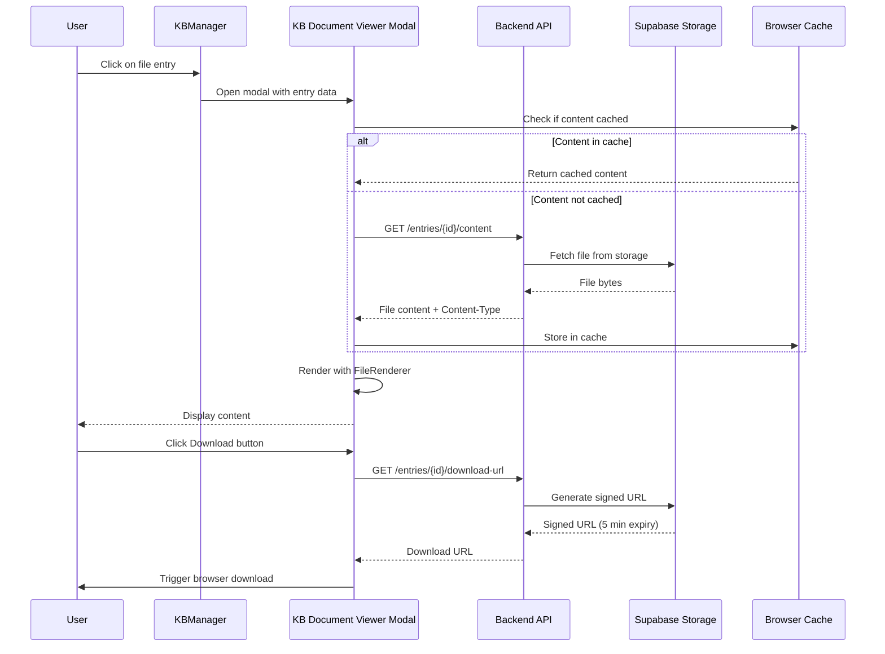
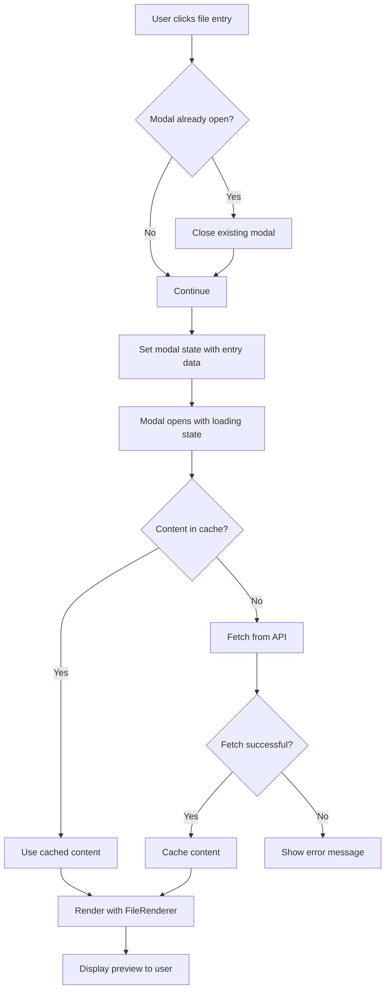
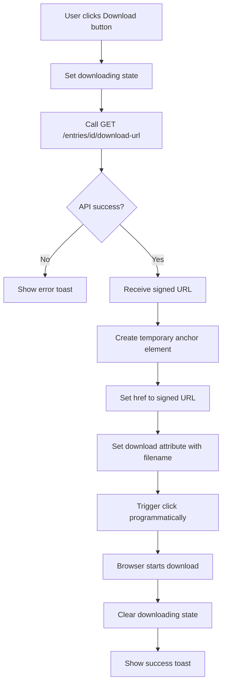
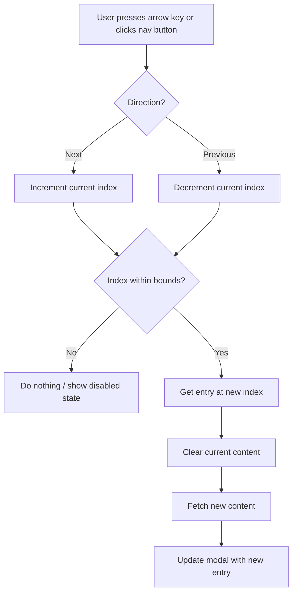

# Design: kb-document-preview

## 1. Architecture Overview

### 1.1 High-Level Architecture

```mermaid
graph TB
    subgraph Frontend
        A[Knowledge Base Page] --> B[Knowledge Base Manager]
        B --> C[File Tree Items]
        C --> D[KB Document Viewer Modal]
        D --> E[FileRenderer Components]
        E --> F1[MarkdownRenderer]
        E --> F2[CodeRenderer]
        E --> F3[PdfRenderer]
        E --> F4[ImageRenderer]
        E --> F5[CsvRenderer]
        E --> F6[XlsxRenderer]
    end
    
    subgraph Backend
        G[FastAPI API] --> H[KB Content Endpoint]
        G --> I[KB Download URL Endpoint]
        H --> J[Supabase Storage Client]
        I --> J
    end
    
    subgraph Storage
        J --> K[S3 Bucket: file-uploads]
        K --> L[knowledge-base/{folder_id}/{entry_id}/{filename}]
    end
    
    D -->|Fetch Content| H
    D -->|Get Download URL| I
    C -->|Click File| D
```

### 1.2 Data Flow Diagram



## 2. Component Design

### 2.1 Frontend Components

#### Component: `kb-document-viewer-modal.tsx`

New modal component for previewing Knowledge Base documents.

```typescript
interface KBDocumentViewerModalProps {
  open: boolean;
  onOpenChange: (open: boolean) => void;
  entry: Entry | null;  // Current file entry
  entries?: Entry[];    // All entries in folder for navigation
  onRefresh?: () => void;
}

interface Entry {
  entry_id: string;
  filename: string;
  file_path: string;
  file_size: number;
  mime_type: string;
  summary: string;
  folder_id: string;
  created_at: string;
}
```

**Key Features:**
- Fullscreen modal using shadcn Dialog
- Header with filename, size, close button
- Toolbar with Download, Copy, Edit Summary buttons
- Content area using FileRenderer
- Navigation arrows for next/previous files
- Loading states and error handling
- Keyboard shortcuts (ESC to close, arrows to navigate)

**State Management:**
```typescript
const [fileContent, setFileContent] = useState<string | Blob | null>(null);
const [isLoading, setIsLoading] = useState(false);
const [error, setError] = useState<string | null>(null);
const [currentIndex, setCurrentIndex] = useState(0);
const [isDownloading, setIsDownloading] = useState(false);
const [isCopying, setIsCopying] = useState(false);
```

#### Component Updates: `knowledge-base-manager.tsx`

Modifications to existing component:

1. Add click handler for file entries
2. Add state for document viewer modal
3. Wire up modal open/close
4. Pass entry data to modal

```typescript
// Add state
const [documentViewerModal, setDocumentViewerModal] = useState<{
  isOpen: boolean;
  entry: Entry | null;
  entries: Entry[];
}>({
  isOpen: false,
  entry: null,
  entries: [],
});

// Add handler
const handleFileClick = (file: TreeItem) => {
  if (file.type !== 'file' || !file.data) return;
  
  const folder = treeData.find(f => f.id === file.parentId);
  const folderEntries = folder?.children
    ?.map(c => c.data as Entry)
    .filter(Boolean) || [];
  
  setDocumentViewerModal({
    isOpen: true,
    entry: file.data as Entry,
    entries: folderEntries,
  });
};
```

#### Component: File Tree Item Enhancement

Update `shared-kb-tree.tsx` or file rendering in `knowledge-base-manager.tsx`:

```typescript
// Enhanced file card with preview capability
<button
  onClick={() => handleFileClick(file)}
  className="flex flex-col items-center p-3 rounded-lg hover:bg-muted/50 cursor-pointer"
>
  <FileIcon type={getFileType(file.name)} className="h-8 w-8" />
  <span className="text-sm truncate max-w-full">{file.name}</span>
  <span className="text-xs text-muted-foreground">
    {formatFileSize(file.file_size)}
  </span>
</button>
```

### 2.2 Backend API Design

#### Endpoint: Get File Content

```python
@router.get("/entries/{entry_id}/content")
async def get_entry_content(
    entry_id: str,
    user_id: str = Depends(verify_and_get_user_id_from_jwt)
):
    """
    Get the content of a knowledge base entry.
    Returns the file content with appropriate Content-Type header.
    """
    try:
        client = await DBConnection().client
        account_id = user_id
        
        # Get entry and verify ownership
        result = await client.table('knowledge_base_entries').select(
            'entry_id, filename, file_path, mime_type, account_id'
        ).eq('entry_id', entry_id).eq('account_id', account_id).execute()
        
        if not result.data:
            raise HTTPException(status_code=404, detail="Entry not found")
        
        entry = result.data[0]
        
        # Fetch file from Supabase Storage
        file_response = await client.storage.from_('file-uploads').download(
            entry['file_path']
        )
        
        # Return file content with proper headers
        return Response(
            content=file_response,
            media_type=entry['mime_type'] or 'application/octet-stream',
            headers={
                'Content-Disposition': f'inline; filename="{entry["filename"]}"',
                'Cache-Control': 'private, max-age=3600',
            }
        )
        
    except Exception as e:
        logger.error(f"Error fetching file content: {str(e)}")
        raise HTTPException(status_code=500, detail="Failed to fetch file content")
```

#### Endpoint: Get Download URL

```python
@router.get("/entries/{entry_id}/download-url")
async def get_entry_download_url(
    entry_id: str,
    user_id: str = Depends(verify_and_get_user_id_from_jwt)
):
    """
    Generate a signed download URL for a knowledge base entry.
    URL is valid for 5 minutes.
    """
    try:
        client = await DBConnection().client
        account_id = user_id
        
        # Verify ownership
        result = await client.table('knowledge_base_entries').select(
            'entry_id, filename, file_path, account_id'
        ).eq('entry_id', entry_id).eq('account_id', account_id).execute()
        
        if not result.data:
            raise HTTPException(status_code=404, detail="Entry not found")
        
        entry = result.data[0]
        
        # Generate signed URL (5 minutes expiry)
        signed_url = await client.storage.from_('file-uploads').create_signed_url(
            entry['file_path'],
            expires_in=300  # 5 minutes
        )
        
        return {
            'download_url': signed_url['signedURL'],
            'filename': entry['filename'],
            'expires_in': 300
        }
        
    except Exception as e:
        logger.error(f"Error generating download URL: {str(e)}")
        raise HTTPException(status_code=500, detail="Failed to generate download URL")
```

### 2.3 File Type Detection and Icon Mapping

```typescript
// lib/utils/file-icons.ts

export function getFileIcon(filename: string): LucideIcon {
  const ext = filename.split('.').pop()?.toLowerCase() || '';
  
  const iconMap: Record<string, LucideIcon> = {
    // Documents
    'pdf': FileText,
    'doc': FileText,
    'docx': FileText,
    'txt': FileText,
    'md': FileText,
    
    // Spreadsheets
    'xlsx': Sheet,
    'xls': Sheet,
    'csv': Sheet,
    
    // Code
    'js': Code,
    'ts': Code,
    'py': Code,
    'json': Code,
    
    // Images
    'png': Image,
    'jpg': Image,
    'jpeg': Image,
    'gif': Image,
    'svg': Image,
    
    // Default
    'default': File,
  };
  
  return iconMap[ext] || iconMap['default'];
}

export function getFileType(filename: string): string {
  const ext = filename.split('.').pop()?.toLowerCase() || '';
  
  if (['png', 'jpg', 'jpeg', 'gif', 'webp', 'svg'].includes(ext)) return 'image';
  if (['pdf'].includes(ext)) return 'pdf';
  if (['md', 'markdown'].includes(ext)) return 'markdown';
  if (['js', 'ts', 'py', 'json', 'html', 'css'].includes(ext)) return 'code';
  if (['csv', 'tsv'].includes(ext)) return 'csv';
  if (['xlsx', 'xls'].includes(ext)) return 'xlsx';
  
  return 'text';
}
```

## 3. Data Models

### 3.1 Entry Interface (Frontend)

```typescript
// Reuse existing Entry interface from use-folders.ts
export interface Entry {
  entry_id: string;
  filename: string;
  summary: string;
  file_size: number;
  created_at: string;
  
  // Additional fields needed for preview (already in DB)
  file_path?: string;
  mime_type?: string;
  folder_id?: string;
}
```

No changes needed - existing Entry interface has all required fields.

### 3.2 API Response Models

```python
# Backend response model for download URL
class DownloadUrlResponse(BaseModel):
    download_url: str
    filename: str
    expires_in: int
```

## 4. Business Process

### 4.1 Process: Open File Preview



### 4.2 Process: Download File



### 4.3 Process: Navigate Between Files



## 5. Error Handling Strategy

### 5.1 Frontend Error Scenarios

| Scenario | Handling |
|----------|----------|
| File not found (404) | Show error message in modal: "File not found or you don't have access" |
| Network error during fetch | Show retry button with error message |
| Large file timeout | Show progress indicator, allow cancellation |
| Unsupported file type | Show "Preview not available" with download option |
| Corrupted file content | Show error with option to download raw file |

### 5.2 Backend Error Scenarios

| Scenario | HTTP Status | Response |
|----------|-------------|----------|
| Entry not found or no access | 404 | `{"detail": "Entry not found"}` |
| S3 file missing | 404 | `{"detail": "File not found in storage"}` |
| S3 access error | 500 | `{"detail": "Failed to fetch file content"}` |
| Invalid entry_id format | 400 | `{"detail": "Invalid entry ID"}` |
| JWT token invalid/expired | 401 | `{"detail": "Unauthorized"}` |

### 5.3 Error Recovery Flow

```typescript
// Retry logic for failed fetches
const fetchWithRetry = async (
  entryId: string,
  maxRetries = 3
): Promise<Response> => {
  for (let i = 0; i < maxRetries; i++) {
    try {
      const response = await fetch(`${API_URL}/knowledge-base/entries/${entryId}/content`);
      if (response.ok) return response;
      if (response.status === 404) throw new Error('File not found');
    } catch (error) {
      if (i === maxRetries - 1) throw error;
      await new Promise(resolve => setTimeout(resolve, 1000 * (i + 1)));
    }
  }
  throw new Error('Max retries exceeded');
};
```

## 6. Security Considerations

### 6.1 Authentication & Authorization

- All endpoints require valid JWT token via `Depends(verify_and_get_user_id_from_jwt)`
- Database queries include `account_id` filter to enforce RLS
- Signed URLs expire after 5 minutes
- No file content is exposed without ownership verification

### 6.2 Content Sanitization

- HTML content sanitized by existing FileRenderer components
- Markdown rendering uses safe HTML parser
- SVG images loaded with `sandbox` attribute to prevent script execution
- PDF rendering in isolated iframe context

### 6.3 Rate Limiting

```python
# Add rate limiting to prevent abuse
from slowapi import Limiter
from slowapi.util import get_remote_address

limiter = Limiter(key_func=get_remote_address)

@router.get("/entries/{entry_id}/content")
@limiter.limit("60/minute")  # 60 requests per minute per IP
async def get_entry_content(...):
    ...

@router.get("/entries/{entry_id}/download-url")
@limiter.limit("30/minute")  # 30 download URLs per minute
async def get_entry_download_url(...):
    ...
```

## 7. Performance Optimizations

### 7.1 Content Caching Strategy

```typescript
// Simple in-memory cache for session
class FileContentCache {
  private cache = new Map<string, {
    content: string | Blob;
    contentType: string;
    timestamp: number;
  }>();
  
  private MAX_AGE = 5 * 60 * 1000; // 5 minutes
  private MAX_SIZE = 50; // Max 50 files cached
  
  set(entryId: string, content: string | Blob, contentType: string) {
    if (this.cache.size >= this.MAX_SIZE) {
      const firstKey = this.cache.keys().next().value;
      this.cache.delete(firstKey);
    }
    
    this.cache.set(entryId, {
      content,
      contentType,
      timestamp: Date.now(),
    });
  }
  
  get(entryId: string): { content: string | Blob; contentType: string } | null {
    const cached = this.cache.get(entryId);
    if (!cached) return null;
    
    if (Date.now() - cached.timestamp > this.MAX_AGE) {
      this.cache.delete(entryId);
      return null;
    }
    
    return { content: cached.content, contentType: cached.contentType };
  }
}

export const fileContentCache = new FileContentCache();
```

### 7.2 Lazy Loading for File Lists

```typescript
// Only fetch file metadata initially, not content
// Content fetched on-demand when modal opens
const { folders, loading } = useKnowledgeFolders();

// No change needed - already lazy loads entries on folder expand
```

### 7.3 Progressive Rendering for Large Files

```typescript
// For files over 5MB, show loading indicator
const [loadingProgress, setLoadingProgress] = useState(0);

const fetchLargeFile = async (entryId: string) => {
  const response = await fetch(`${API_URL}/knowledge-base/entries/${entryId}/content`);
  const reader = response.body?.getReader();
  const contentLength = +(response.headers.get('Content-Length') ?? 0);
  
  let receivedLength = 0;
  const chunks = [];
  
  while (true) {
    const { done, value } = await reader!.read();
    if (done) break;
    
    chunks.push(value);
    receivedLength += value.length;
    setLoadingProgress((receivedLength / contentLength) * 100);
  }
  
  return new Blob(chunks);
};
```

## 8. Testing Strategy

### 8.1 Unit Tests

**Frontend Components:**
- `kb-document-viewer-modal.tsx`
  - Test modal open/close
  - Test navigation between files
  - Test download button functionality
  - Test copy button functionality
  - Test error states
  - Test loading states

**Backend Endpoints:**
- `get_entry_content()`
  - Test successful file fetch
  - Test 404 for non-existent entry
  - Test 404 for unauthorized access
  - Test S3 error handling
- `get_entry_download_url()`
  - Test signed URL generation
  - Test ownership verification
  - Test URL expiration

### 8.2 Integration Tests

1. **End-to-End Preview Flow**
   - Upload file → Open preview → Verify content displayed
   - Test with different file types (MD, PDF, Image, CSV, XLSX)

2. **Download Flow**
   - Open preview → Click download → Verify file downloaded

3. **Navigation Flow**
   - Open folder with multiple files → Preview first → Navigate to next → Verify correct file shown

### 8.3 Manual Testing Checklist

- [ ] Preview markdown file with images
- [ ] Preview PDF document
- [ ] Preview image (PNG/JPG)
- [ ] Preview code file (JS/Python)
- [ ] Preview CSV file
- [ ] Preview XLSX file
- [ ] Download file and verify contents
- [ ] Copy content to clipboard
- [ ] Navigate with arrow keys
- [ ] Navigate with next/prev buttons
- [ ] Test with large files (>10MB)
- [ ] Test error handling (delete file, then try preview)
- [ ] Test on mobile/tablet viewports

## 9. Deployment Considerations

### 9.1 Migration Path

No database migrations required - uses existing schema.

### 9.2 Feature Flags

Not required - backward compatible addition.

### 9.3 Rollback Plan

If issues arise:
1. Remove new API endpoints from `backend/core/knowledge_base/api.py`
2. Revert frontend components to previous version
3. No data loss - read-only feature

### 9.4 Monitoring

Add logging for:
- File fetch requests (success/failure rates)
- Download URL generation
- Large file fetch performance
- Error types and frequencies

```python
logger.info(f"File content fetched: entry_id={entry_id}, size={len(content)}, duration={duration}ms")
logger.error(f"File fetch failed: entry_id={entry_id}, error={str(e)}")
```

## 10. Future Enhancements

Potential improvements for future iterations:

1. **Thumbnail Generation**
   - Generate thumbnails for PDF first pages
   - Cache thumbnails in S3 for faster loading

2. **Full-Text Search**
   - Index document content for search
   - Highlight search terms in preview

3. **Annotation System**
   - Allow users to highlight and comment on documents
   - Store annotations separately from original files

4. **Version Control**
   - Track file versions
   - Compare differences between versions
   - Rollback to previous versions

5. **Collaborative Features**
   - Real-time collaborative viewing
   - Shared cursors and annotations

6. **Advanced File Support**
   - Video playback with transcription
   - Audio playback
   - 3D model rendering
   - Archive file browsing (.zip, .tar)

## 11. Dependencies

### 11.1 Existing Dependencies (No Changes)

- React
- Next.js
- TypeScript
- shadcn/ui components
- Lucide icons
- Supabase client
- FastAPI
- Python-docx
- PyPDF2

### 11.2 New Dependencies (None Required)

All functionality can be implemented using existing dependencies and components.