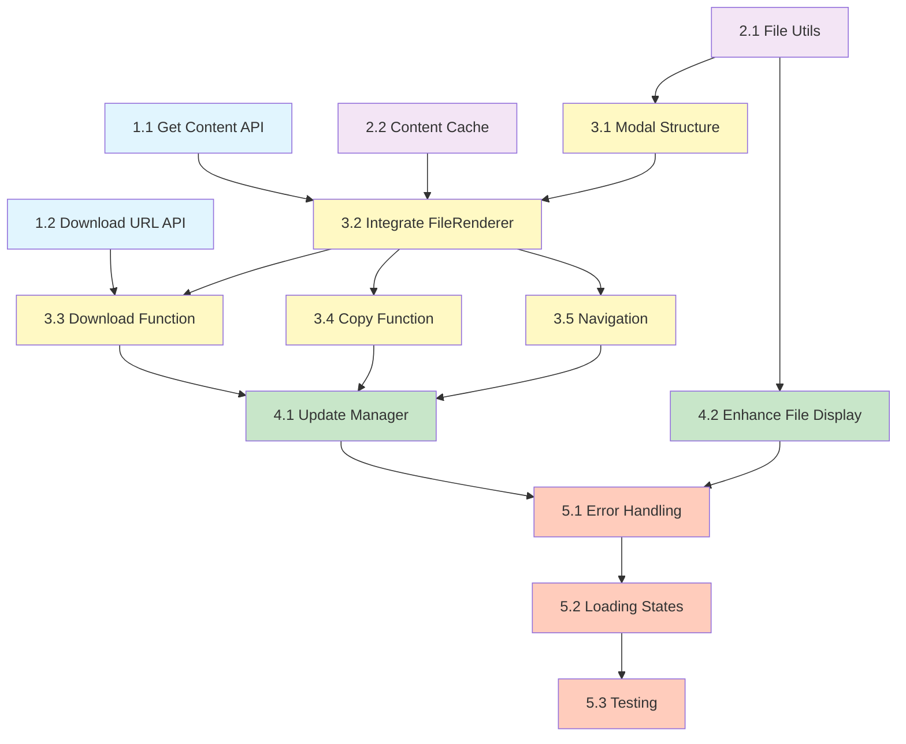

# Implementation Plan: kb-document-preview

## Task Overview

This implementation plan breaks down the kb-document-preview feature into discrete, manageable coding tasks that can be executed by AI coding agents. Each task builds incrementally on previous work and includes specific acceptance criteria.

---

## Phase 1: Backend API Implementation

### Task 1.1: Create Get File Content Endpoint

**Objective:** Implement backend endpoint to fetch file content from Supabase Storage.

**Files:**
- `backend/core/knowledge_base/api.py`

**Description:**
Add a new GET endpoint `/knowledge-base/entries/{entry_id}/content` that:
- Verifies JWT authentication and user ownership of the entry
- Fetches the file from Supabase Storage using the file_path from database
- Returns the file content with appropriate Content-Type and Content-Disposition headers
- Handles errors (entry not found, unauthorized access, S3 errors)
- Includes proper logging for monitoring

**Dependencies:** None

**Acceptance Criteria:**
- Endpoint exists at GET `/knowledge-base/entries/{entry_id}/content`
- Returns 200 with file content for valid requests
- Returns 404 if entry not found or user lacks access
- Returns 500 with error message if S3 fetch fails
- Content-Type header matches file's mime_type from database
- Content-Disposition header set to inline with filename
- Ownership verified via account_id matching JWT user_id

**Requirements:** FR-7, TR-4

---

### Task 1.2: Create Get Download URL Endpoint

**Objective:** Implement endpoint to generate time-limited signed download URLs.

**Files:**
- `backend/core/knowledge_base/api.py`

**Description:**
Add a new GET endpoint `/knowledge-base/entries/{entry_id}/download-url` that:
- Verifies JWT authentication and user ownership
- Generates a signed URL from Supabase Storage with 5-minute expiration
- Returns JSON response with download_url, filename, and expires_in
- Handles errors appropriately with proper HTTP status codes
- Includes logging for monitoring URL generation

**Dependencies:** Task 1.1 (same file, similar structure)

**Acceptance Criteria:**
- Endpoint exists at GET `/knowledge-base/entries/{entry_id}/download-url`
- Returns 200 with JSON containing download_url, filename, expires_in fields
- Signed URL is valid and expires after 5 minutes (300 seconds)
- Returns 404 if entry not found or unauthorized
- Returns 500 if signed URL generation fails
- Ownership verified before URL generation

**Requirements:** FR-8, TR-5

---

## Phase 2: Frontend Utilities

### Task 2.1: Create File Type Utilities

**Objective:** Create utility functions for file type detection and icon mapping.

**Files:**
- `frontend/src/lib/utils/file-utils.ts` (new file)

**Description:**
Create utility module with functions:
- `getFileIcon(filename: string): LucideIcon` - Returns appropriate Lucide icon based on file extension
- `getFileType(filename: string): string` - Returns file category (image, pdf, markdown, code, csv, xlsx, text)
- `formatFileSize(bytes: number): string` - Formats bytes to human-readable string (B, KB, MB, GB)

Map file extensions to icons and types according to design document specifications.

**Dependencies:** None

**Acceptance Criteria:**
- File created at `frontend/src/lib/utils/file-utils.ts`
- `getFileIcon()` returns correct Lucide icon for common extensions (pdf, doc, xlsx, csv, js, ts, py, png, jpg)
- `getFileIcon()` returns default File icon for unknown extensions
- `getFileType()` correctly categorizes files into: image, pdf, markdown, code, csv, xlsx, text
- `formatFileSize()` formats bytes correctly (e.g., 1024 → "1.0 KB", 1048576 → "1.0 MB")
- All functions properly exported

**Requirements:** FR-5, Design Section 2.3

---

### Task 2.2: Create File Content Cache

**Objective:** Implement in-memory cache for file content to avoid redundant API requests.

**Files:**
- `frontend/src/lib/cache/file-content-cache.ts` (new file)

**Description:**
Create a FileContentCache class that:
- Stores file content in memory with entry_id as key
- Includes timestamp and content type metadata
- Implements TTL (5 minutes) for cache entries
- Implements LRU eviction (max 50 entries)
- Provides set, get, clear, and has methods
- Exports singleton instance

**Dependencies:** None

**Acceptance Criteria:**
- File created at `frontend/src/lib/cache/file-content-cache.ts`
- Cache stores content with metadata (content, contentType, timestamp)
- get() returns null for expired entries (>5 minutes old)
- Cache automatically evicts oldest entry when size exceeds 50
- Exported singleton instance named `fileContentCache`
- TypeScript types properly defined

**Requirements:** TR-1, Design Section 7.1

---

## Phase 3: Frontend Modal Component

### Task 3.1: Create KB Document Viewer Modal Component (Structure)

**Objective:** Create the basic modal structure with UI layout.

**Files:**
- `frontend/src/components/knowledge-base/kb-document-viewer-modal.tsx` (new file)

**Description:**
Create new modal component with:
- Dialog component from shadcn/ui as base
- Props interface (open, onOpenChange, entry, entries, onRefresh)
- Modal header with file icon, filename, file size, and close button
- Toolbar with Download, Copy Content, Edit Summary buttons (placeholder handlers)
- Main content area (empty for now, will add FileRenderer in next task)
- Navigation arrows for previous/next files (visible when entries array has >1 item)
- Loading state UI (skeleton/spinner)
- Error state UI (error message with retry button)
- Keyboard event handlers (ESC to close, arrow keys for navigation)

**Dependencies:** Task 2.1 (file-utils for icons)

**Acceptance Criteria:**
- Component file created with proper TypeScript types
- Modal opens/closes based on open prop
- Header displays filename, size (formatted), and appropriate file icon
- Toolbar has Download, Copy Content, Edit Summary buttons (non-functional placeholders)
- Navigation arrows appear only when entries.length > 1
- ESC key closes modal
- Arrow left/right keys trigger navigation (placeholder handlers)
- Loading state shows skeleton UI
- Error state shows error message with Retry button

**Requirements:** FR-1, FR-3, FR-4, FR-11

---

### Task 3.2: Integrate FileRenderer in Modal

**Objective:** Add file content fetching and rendering using existing FileRenderer component.

**Files:**
- `frontend/src/components/knowledge-base/kb-document-viewer-modal.tsx`

**Description:**
Enhance the modal component with:
- State management for file content (string | Blob | null)
- useEffect to fetch content when entry changes
- Integration with fileContentCache from Task 2.2
- API call to GET /knowledge-base/entries/{entry_id}/content
- Content type detection and preparation for FileRenderer
- FileRenderer component integration in content area
- Handle both text content and binary URLs appropriately
- Loading state during fetch
- Error handling with user-friendly messages

Import and use FileRenderer from `@/components/file-renderers` with proper props.

**Dependencies:** Tasks 3.1 (modal structure), 2.2 (cache), 1.1 (API endpoint)

**Acceptance Criteria:**
- Modal fetches content on entry change
- Checks cache before making API request
- Displays loading spinner while fetching
- Renders content using FileRenderer component
- FileRenderer receives correct props (content, binaryUrl, fileName, filePath)
- Handles text files (markdown, code, csv, txt) correctly
- Handles binary files (PDF, images, XLSX) correctly
- Shows error message if fetch fails
- Caches successfully fetched content

**Requirements:** FR-1, FR-2, FR-10, TR-1

---

### Task 3.3: Implement Download Functionality

**Objective:** Add download functionality using signed URL endpoint.

**Files:**
- `frontend/src/components/knowledge-base/kb-document-viewer-modal.tsx`

**Description:**
Implement download button handler:
- Add isDownloading state
- Create handleDownload async function
- Call GET /knowledge-base/entries/{entry_id}/download-url
- Use signed URL to trigger browser download via anchor element
- Show loading state on button during download
- Display success toast after download starts
- Handle errors with error toast
- Clean up temporary anchor element

**Dependencies:** Tasks 3.2 (modal with content), 1.2 (download URL endpoint)

**Acceptance Criteria:**
- Download button triggers file download
- Button shows loading spinner while fetching URL
- Browser download starts with correct filename
- Success toast appears: "Download started"
- Error toast appears if download URL fetch fails
- Download state resets after completion/error
- Temporary DOM elements are cleaned up

**Requirements:** FR-3, Design Section 4.2

---

### Task 3.4: Implement Copy Content Functionality

**Objective:** Add copy-to-clipboard functionality for text-based files.

**Files:**
- `frontend/src/components/knowledge-base/kb-document-viewer-modal.tsx`

**Description:**
Implement copy button handler:
- Add isCopying state
- Create handleCopyContent async function
- Check if content is text-based (not Blob)
- Use navigator.clipboard.writeText() to copy content
- Show loading state on button during copy
- Display success toast with checkmark icon
- Handle errors (clipboard API not available, permission denied)
- Disable button for binary files

**Dependencies:** Task 3.2 (modal with content)

**Acceptance Criteria:**
- Copy Content button copies text content to clipboard
- Button shows loading spinner during copy operation
- Success toast appears: "Content copied to clipboard"
- Button changes icon to checkmark briefly after success
- Button is disabled for binary files (PDF, images, XLSX)
- Error handling for clipboard permission issues
- Works in both HTTP (localhost) and HTTPS contexts

**Requirements:** FR-4

---

### Task 3.5: Implement File Navigation

**Objective:** Add navigation between files in the same folder.

**Files:**
- `frontend/src/components/knowledge-base/kb-document-viewer-modal.tsx`

**Description:**
Implement navigation functionality:
- Track current file index in entries array
- Implement handlePrevious() function
- Implement handleNext() function
- Update entry state and trigger content refetch on navigation
- Enable/disable navigation arrows based on current position
- Support keyboard navigation (left/right arrow keys)
- Clear content and show loading when switching files
- Prevent navigation spam (disable during loading)

**Dependencies:** Task 3.2 (modal with content fetching)

**Acceptance Criteria:**
- Clicking next arrow shows next file in entries array
- Clicking previous arrow shows previous file
- Left/right arrow keys trigger navigation
- Previous arrow disabled at first file
- Next arrow disabled at last file
- Navigation clears current content and shows loading
- Cannot navigate while content is loading
- Current file index updates correctly

**Requirements:** FR-7 (acceptance criteria), Design Section 4.3

---

## Phase 4: Integration with Knowledge Base Manager

### Task 4.1: Update Knowledge Base Manager to Open Modal

**Objective:** Integrate document viewer modal into existing Knowledge Base manager component.

**Files:**
- `frontend/src/components/knowledge-base/knowledge-base-manager.tsx`

**Description:**
Modify KnowledgeBaseManager component:
- Import KBDocumentViewerModal component
- Add state for modal (isOpen, entry, entries)
- Create handleFileClick function
- Update file item click handlers to call handleFileClick
- Render KBDocumentViewerModal component with proper props
- Pass onRefresh callback to refresh folder entries after operations
- Ensure modal state resets properly on close

**Dependencies:** Tasks 3.1-3.5 (complete modal component)

**Acceptance Criteria:**
- Clicking file entry opens document viewer modal
- Modal receives correct entry data
- Modal receives all entries from current folder for navigation
- Modal onRefresh callback triggers folder entries refetch
- Modal can be closed via X button, ESC key, or backdrop click
- State resets when modal closes
- Multiple rapid clicks don't cause issues

**Requirements:** FR-1, Design Section 2.1

---

### Task 4.2: Enhance File Display with Icons and Metadata

**Objective:** Update file entry display to show appropriate icons and formatted metadata.

**Files:**
- `frontend/src/components/knowledge-base/knowledge-base-manager.tsx`
- Possibly `frontend/src/components/knowledge-base/shared-kb-tree.tsx`

**Description:**
Update file entry rendering:
- Use getFileIcon() from file-utils to show appropriate icon
- Display formatted file size using formatFileSize()
- Show upload date in relative format (e.g., "2 days ago")
- Add hover effect to indicate clickability
- Ensure consistent styling with existing UI
- Maintain existing drag-and-drop functionality

**Dependencies:** Task 2.1 (file-utils)

**Acceptance Criteria:**
- Each file entry shows appropriate icon based on file type
- File size displayed in human-readable format (KB, MB)
- Upload date shown in relative format
- Hover effect indicates file is clickable
- Click still opens document viewer modal
- Drag-and-drop still works for moving files
- Consistent with existing Knowledge Base UI design

**Requirements:** FR-5, FR-6

---

## Phase 5: Testing and Polish

### Task 5.1: Add Error Handling and Edge Cases

**Objective:** Ensure robust error handling throughout the feature.

**Files:**
- `backend/core/knowledge_base/api.py`
- `frontend/src/components/knowledge-base/kb-document-viewer-modal.tsx`

**Description:**
Add comprehensive error handling:
- Backend: Handle S3 timeout errors
- Backend: Handle invalid entry_id format
- Backend: Handle missing file_path in database
- Frontend: Handle network timeout (>30s)
- Frontend: Handle large file warnings (>50MB)
- Frontend: Handle unsupported file types gracefully
- Frontend: Add retry logic with exponential backoff
- Add user-friendly error messages for all scenarios

**Dependencies:** All previous tasks

**Acceptance Criteria:**
- S3 timeout returns proper error response
- Invalid UUID format returns 400 Bad Request
- Missing file shows appropriate error message
- Network timeout shows retry option
- Large files (>50MB) show size warning before loading
- Unsupported file types show "Preview not available" with download option
- Failed requests can be retried up to 3 times
- All error messages are user-friendly

**Requirements:** TR-2, Design Section 5

---

### Task 5.2: Add Loading States and Progress Indicators

**Objective:** Improve UX with proper loading feedback.

**Files:**
- `frontend/src/components/knowledge-base/kb-document-viewer-modal.tsx`

**Description:**
Enhance loading states:
- Add skeleton UI for initial content load
- Add progress bar for large files (>5MB)
- Show file size and estimated time for large downloads
- Add spinner on buttons during actions
- Prevent double-clicks during operations
- Add transition animations for smooth UX

**Dependencies:** All previous tasks

**Acceptance Criteria:**
- Skeleton UI appears while content loads
- Progress bar shown for files >5MB
- Large file downloads show estimated time
- Buttons disabled during operations
- Smooth fade-in transition when content loads
- No layout shift during loading → loaded transition

**Requirements:** TR-2, Design Section 7.3

---

### Task 5.3: Manual Testing and Bug Fixes

**Objective:** Test the complete feature with various file types and scenarios.

**Files:**
- All previously created/modified files

**Description:**
Perform manual testing:
- Test preview for each supported file type (MD, PDF, PNG, JPG, CSV, XLSX, JS, PY, TXT, HTML)
- Test download functionality for various file sizes
- Test copy content for text files
- Test navigation between multiple files
- Test error scenarios (deleted files, network errors)
- Test on different browsers (Chrome, Firefox, Safari)
- Test responsive design on mobile/tablet
- Fix any bugs discovered during testing

**Dependencies:** All previous tasks

**Acceptance Criteria:**
- All file types render correctly in preview
- Downloads work for all file types
- Copy works for all text-based files
- Navigation works smoothly
- Error states display properly
- Works on Chrome, Firefox, Safari
- Mobile/tablet layouts are usable
- No console errors or warnings
- All manual testing checklist items pass

**Requirements:** Design Section 8.3

---

## Task Dependencies Graph

## Execution Strategy

**Recommended Order:**
1. Backend first (Phase 1) - enables testing with curl/Postman
2. Utilities (Phase 2) - foundational code with no dependencies
3. Modal component (Phase 3) - core feature implementation
4. Integration (Phase 4) - connect everything together
5. Polish (Phase 5) - ensure quality and robustness

**Parallel Execution Opportunities:**
- Task 1.1 and Task 1.2 can be done in parallel (same file, independent functions)
- Task 2.1 and Task 2.2 can be done in parallel (different files, no dependencies)
- Tasks 3.3, 3.4, 3.5 can be done in parallel (after 3.2 completes)

**Total Tasks:** 13 discrete implementation tasks
**Estimated Complexity:** Medium - reuses existing components and patterns
**Risk Areas:** S3 integration, large file handling, error scenarios
<!-- ORCHESTRATOR-TASKS-SYNC START -->
## Orchestrator Task Status

- [x] **1.1** — Create Get File Content Endpoint
  - Status: completed
  - Atualizado: 2025-10-29T04:55:47.577620+00:00
  - Assistente: não atribuído
- [x] **1.2** — Create Get Download URL Endpoint
  - Status: completed
  - Atualizado: 2025-10-29T04:55:55.411137+00:00
  - Assistente: não atribuído
- [x] **2.1** — Create File Type Utilities
  - Status: completed
  - Atualizado: 2025-10-29T04:56:02.321419+00:00
  - Assistente: não atribuído
- [x] **2.2** — Create File Content Cache
  - Status: completed
  - Atualizado: 2025-10-29T04:56:09.448659+00:00
  - Assistente: não atribuído
- [x] **3.1** — Create KB Document Viewer Modal Component Structure
  - Status: completed
  - Atualizado: 2025-10-29T04:56:14.980558+00:00
  - Assistente: não atribuído
- [x] **3.2** — Integrate FileRenderer in Modal
  - Status: completed
  - Atualizado: 2025-10-29T04:56:20.701589+00:00
  - Assistente: não atribuído
- [x] **3.3** — Implement Download Functionality
  - Status: completed
  - Atualizado: 2025-10-29T04:56:28.792551+00:00
  - Assistente: não atribuído
- [x] **3.4** — Implement Copy Content Functionality
  - Status: completed
  - Atualizado: 2025-10-29T04:56:34.465803+00:00
  - Assistente: não atribuído
- [x] **3.5** — Implement File Navigation
  - Status: completed
  - Atualizado: 2025-10-29T04:56:44.417028+00:00
  - Assistente: não atribuído
- [ ] **batch-phase-1-2-3** — Task batch-phase-1-2-3
  - Status: running
  - Atualizado: 2025-10-29T04:46:47.463485+00:00
  - Assistente: Claude Code (terminal a506d00c-143d-40b0-977f-ea607b674093) — comando: claude --dangerously-skip-permissions "Execute Tasks 1.1 through 3.5 for KB Document Preview feature. TASK 1.1 - Create ...
<!-- ORCHESTRATOR-TASKS-SYNC END -->
