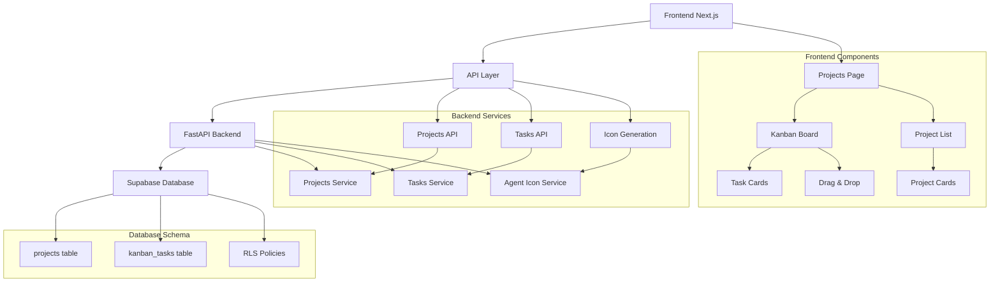
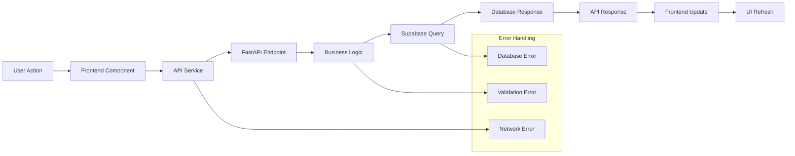
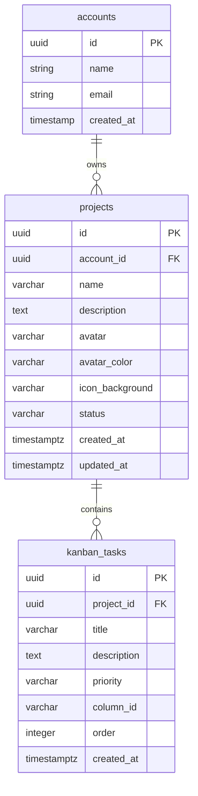
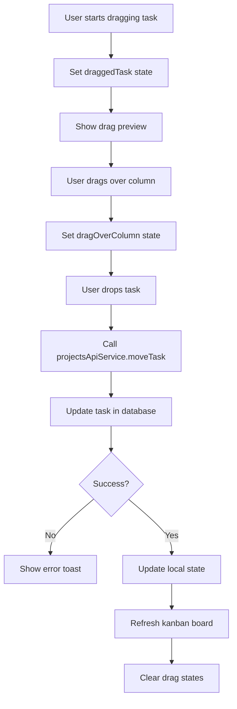
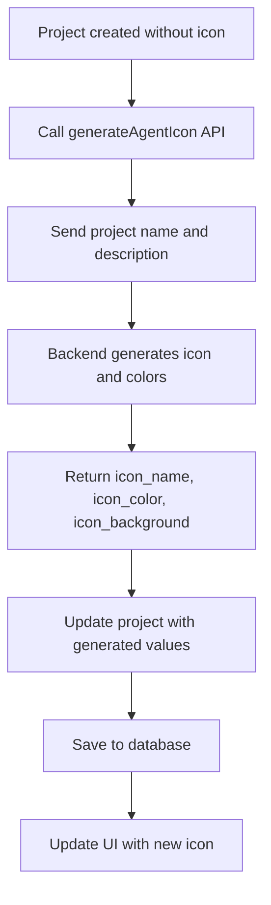

# Design Document

## Overview

Este documento define a arquitetura técnica para implementação da página de Projetos (Kanban) no sistema Suna, seguindo os padrões existentes do projeto e integrando-se com a infraestrutura atual (Supabase, FastAPI, Next.js).

## Architecture Design

### System Architecture Diagram



### Data Flow Diagram



## Component Design

### Frontend Components

#### Projects Page Component
- **Responsibilities**: 
  - Gerenciar estado geral da página de projetos
  - Controlar navegação entre lista de projetos e quadro Kanban
  - Coordenar diálogos e modais
- **Interfaces**: 
  - `IProjectsPageProps`: { userId: string }
  - `IProjectsPageState`: { activeTab, selectedProject, projects, tasks }
- **Dependencies**: 
  - Projects API Service
  - Kanban Board Component
  - Project List Component

#### Kanban Board Component
- **Responsibilities**:
  - Renderizar quadro Kanban com 4 colunas
  - Gerenciar drag & drop de tarefas
  - Controlar estado de arrastar/soltar
- **Interfaces**:
  - `IKanbanBoardProps`: { projectId: string, tasks: KanbanTask[] }
  - `IKanbanColumnProps`: { columnId: TaskStatus, tasks: KanbanTask[] }
- **Dependencies**:
  - Task Card Component
  - Drag & Drop Library (@dnd-kit)
  - Tasks API Service

#### Project List Component
- **Responsibilities**:
  - Exibir lista de projetos com cards
  - Gerenciar criação/edição/exclusão de projetos
  - Implementar busca e filtros
- **Interfaces**:
  - `IProjectListProps`: { projects: Project[], onSelectProject: Function }
  - `IProjectCardProps`: { project: Project, onSelect: Function }
- **Dependencies**:
  - Projects API Service
  - Project Dialog Component

### Backend Services

#### Projects Service
- **Responsibilities**:
  - CRUD operations para projetos
  - Validação de regras de negócio
  - Integração com geração de ícones
- **Interfaces**:
  - `create_project(data: ProjectCreate) -> Project`
  - `get_projects(user_id: UUID, filters: ProjectFilters) -> List[Project]`
  - `update_project(project_id: UUID, data: ProjectUpdate) -> Project`
  - `delete_project(project_id: UUID) -> None`
- **Dependencies**:
  - Supabase Client
  - Agent Icon Generation Service

#### Tasks Service
- **Responsibilities**:
  - CRUD operations para tarefas Kanban
  - Gerenciamento de movimentação entre colunas
  - Ordenação e priorização
- **Interfaces**:
  - `create_task(project_id: UUID, data: TaskCreate) -> KanbanTask`
  - `move_task(task_id: UUID, new_column: TaskStatus, new_order: int) -> KanbanTask`
  - `update_task(task_id: UUID, data: TaskUpdate) -> KanbanTask`
  - `delete_task(task_id: UUID) -> None`
- **Dependencies**:
  - Supabase Client
  - Validation Service

## Data Models

### Core Data Structure Definitions

```typescript
// Project - Projeto/Quadro Kanban
interface Project {
  id: string;
  account_id: string;
  name: string;
  description: string | null;
  avatar: string;           // VARCHAR(10) - emoji/ícone
  avatar_color: string;     // VARCHAR(7) - formato hex #RRGGBB
  icon_background: string;  // gerado automaticamente
  status: 'active' | 'completed' | 'archived';
  created_at: string;
  updated_at: string;
  task_count?: number;
  completed_task_count?: number;
}

interface ProjectCreate {
  name: string;
  description?: string | null;
  avatar?: string;
  avatar_color?: string;
  status?: 'active' | 'completed' | 'archived';
}

interface ProjectUpdate {
  name?: string;
  description?: string | null;
  avatar?: string;
  avatar_color?: string;
}

// Task - Tarefa do Kanban
enum TaskStatus {
  BACKLOG = "backlog",
  TODO = "todo", 
  IN_PROGRESS = "in_progress",
  DONE = "done",
}

enum TaskPriority {
  LOW = "low",
  MEDIUM = "medium",
  HIGH = "high",
}

interface KanbanTask {
  id: string;
  project_id: string;
  title: string;
  description: string | null;
  priority: TaskPriority;
  column_id: TaskStatus;
  order: number;
  created_at: string;
}

interface KanbanColumn {
  id: TaskStatus;
  title: string;
  color: string;
  tasks: KanbanTask[];
}

interface KanbanBoard {
  project_id: string;
  project_name: string;
  columns: KanbanColumn[];
}

// API Response Types
interface ProjectListResponse {
  projects: Project[];
  total: number;
  page: number;
  limit: number;
}

interface KanbanBoardResponse {
  board: KanbanBoard;
  tasks: KanbanTask[];
}
```

### Data Model Diagrams



## Business Process

### Process 1: Project Creation Flow

```mermaid
flowchart TD
    A[User clicks "New Project"] --> B[Open Create Project Dialog]
    B --> C[User fills project details]
    C --> D{Validation}
    D -->|Invalid| E[Show error messages]
    E --> C
    D -->|Valid| F[Call projectsApiService.create]
    F --> G[Generate icon if not provided]
    G --> H[Save to Supabase]
    H --> I{Success?}
    I -->|No| J[Show error toast]
    I -->|Yes| K[Update project list]
    K --> L[Close dialog]
    L --> M[Show success toast]
```

### Process 2: Task Drag & Drop Flow



### Process 3: Icon Generation Flow



## Error Handling Strategy

### Frontend Error Handling
- **Validation Errors**: Exibir mensagens específicas nos formulários
- **Network Errors**: Toast genéricico com opção de retry
- **Permission Errors**: Redirecionar para login ou mostrar acesso negado
- **Not Found Errors**: Exibir estado vazio com opção de criar

### Backend Error Handling
- **Validation Errors**: HTTP 400 com detalhes dos campos
- **Authentication Errors**: HTTP 401 com mensagem padrão
- **Authorization Errors**: HTTP 403 com mensagem de permissão
- **Database Errors**: HTTP 500 com log detalhado
- **Rate Limiting**: HTTP 429 com headers de retry

### Recovery Mechanisms
- **Auto-retry**: Para falhas de rede temporárias
- **Optimistic Updates**: Para feedback imediato ao usuário
- **Rollback**: Reverter estado local em caso de falha
- **Cache Invalidation**: Limpar cache após operações de escrita

## Testing Strategy

### Unit Tests
- **Components**: Testar renderização e interações dos componentes React
- **Services**: Testar lógica de negócio dos serviços de API
- **Utilities**: Testar funções utilitárias e helpers
- **Hooks**: Testar hooks customizados do React

### Integration Tests
- **API Endpoints**: Testar endpoints completos com banco de dados
- **Database Operations**: Testar queries e transações
- **Authentication**: Testar fluxos de autenticação e autorização
- **Error Scenarios**: Testar casos de erro e recuperação

### E2E Tests
- **User Workflows**: Testar fluxos completos do usuário
- **Drag & Drop**: Testar funcionalidade de arrastar e soltar
- **Responsive Design**: Testar em diferentes tamanhos de tela
- **Performance**: Testar performance com grandes volumes de dados

### Test Coverage Targets
- **Unit Tests**: >90% coverage
- **Integration Tests**: >80% coverage  
- **E2E Tests**: Cobertura de todos os fluxos críticos
- **Performance**: <2s para carregar página principal

## Security Considerations

### Authentication & Authorization
- **RLS Policies**: Implementar Row Level Security no Supabase
- **Account Isolation**: Usuários só acessam projetos de suas contas
- **JWT Validation**: Validar tokens em todas as requisições
- **Session Management**: Timeout e refresh automático de sessões

### Data Validation
- **Input Sanitization**: Sanitizar todos os inputs do usuário
- **SQL Injection Prevention**: Usar parameterized queries
- **XSS Protection**: Escapar HTML em renderização dinâmica
- **File Upload Security**: Validar tipos e tamanhos de arquivos

### API Security
- **Rate Limiting**: Limitar requisições por usuário
- **CORS Configuration**: Configurar CORS adequadamente
- **HTTPS Only**: Forçar HTTPS em produção
- **API Versioning**: Versionar API para backward compatibility

## Performance Considerations

### Frontend Optimization
- **Code Splitting**: Dividir código por rotas
- **Lazy Loading**: Carregar componentes sob demanda
- **Virtual Scrolling**: Para listas grandes de tarefas
- **Memoization**: Otimizar re-renders com React.memo

### Backend Optimization
- **Database Indexing**: Índices para queries frequentes
- **Connection Pooling**: Pool de conexões com Supabase
- **Caching Strategy**: Cache para dados frequentemente acessados
- **Pagination**: Implementar paginação em listas grandes

### Database Optimization
- **Query Optimization**: Otimizar queries com EXPLAIN ANALYZE
- **Index Strategy**: Índices compostos para queries complexas
- **Partitioning**: Considerar particionamento para tabelas grandes
- **Monitoring**: Monitorar performance de queries

## Deployment Strategy

### Environment Configuration
- **Development**: Ambiente local com Docker Compose
- **Staging**: Ambiente de testes com dados de produção
- **Production**: Ambiente de produção com monitoramento
- **Feature Flags**: Toggle para funcionalidades experimentais

### Database Migrations
- **Version Control**: Controle de versão de migrations
- **Rollback Strategy**: Strategy para rollback de migrations
- **Data Validation**: Validar dados após migrations
- **Performance Impact**: Medir impacto de migrations

### Monitoring & Logging
- **Application Metrics**: Métricas de performance e uso
- **Error Tracking**: Tracking de erros com Sentry
- **User Analytics**: Analytics de uso da funcionalidade
- **Health Checks**: Health checks para serviços