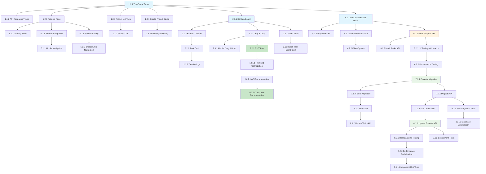

# Implementation Tasks

## Phase 1: Frontend Foundation and UI Components

### 1.1 TypeScript Types and Interfaces
- [ ] 1.1.1 Create project and task type definitions
  - Define Project, ProjectCreate, ProjectUpdate interfaces
  - Define KanbanTask, KanbanColumn, KanbanBoard interfaces
  - Define TaskStatus and TaskPriority enums
  - _Requirements: 2, 3, 4_

- [ ] 1.1.2 Create API response types
  - Define ProjectListResponse, KanbanBoardResponse interfaces
  - Define error response types for consistent error handling
  - Create pagination types for large datasets
  - _Requirements: 6, 7_

### 1.2 Core React Components Structure
- [ ] 1.2.1 Create projects page component
  - Create /app/(dashboard)/projects/page.tsx main page component
  - Implement tab navigation between project list and kanban board
  - Add responsive layout with mobile support
  - _Requirements: 1, 8_

- [ ] 1.2.2 Create projects loading state
  - Create /app/(dashboard)/projects/loading.tsx loading component
  - Implement skeleton loading for better UX
  - Add loading states for different sections
  - _Requirements: 8_

### 1.3 Project List Components
- [ ] 1.3.1 Create project list view component
  - Create ProjectListView component for displaying project cards
  - Implement search and filter functionality
  - Add empty state with call-to-action
  - _Requirements: 1, 6_

- [ ] 1.3.2 Create project card component
  - Create ProjectCard component with avatar, name, description
  - Add project statistics (task count, completion rate)
  - Implement hover states and selection feedback
  - _Requirements: 1, 10_

### 1.4 Project Dialog Components
- [ ] 1.4.1 Create create project dialog
  - Create CreateProjectDialog component with form validation
  - Add color picker and avatar selection following Suna patterns
  - Add placeholder for icon generation integration
  - _Requirements: 2, 10_

- [ ] 1.4.2 Create edit project dialog
  - Create EditProjectDialog component for updating project details
  - Reuse form validation from create dialog
  - Add delete project functionality with confirmation
  - _Requirements: 2, 10_

## Phase 2: Kanban Board UI Implementation

### 2.1 Kanban Board Core Components
- [ ] 2.1.1 Create kanban board component
  - Create KanbanDeskBoard main component with tab management
  - Implement 4-column layout (Backlog, To Do, In Progress, Done)
  - Add responsive design for mobile devices
  - _Requirements: 3, 8_

- [ ] 2.1.2 Create kanban column component
  - Create ColumnContainer component for individual columns
  - Implement column header with title and add task button
  - Add drag-over visual feedback
  - _Requirements: 3, 4_

### 2.2 Task Management Components
- [ ] 2.2.1 Create task card component
  - Create TaskCard component with title, description, priority
  - Add visual indicators for priority levels
  - Implement edit and delete actions
  - _Requirements: 4, 9_

- [ ] 2.2.2 Create task dialog components
  - Create KanbanTaskDialog for creating/editing tasks
  - Create KanbanDeleteDialog for task deletion confirmation
  - Add form validation and error handling
  - _Requirements: 4, 9_

### 2.3 Drag and Drop Implementation
- [ ] 2.3.1 Implement drag and drop functionality
  - Integrate @dnd-kit library for drag and drop
  - Implement task dragging between columns
  - Add visual feedback during drag operations
  - _Requirements: 3, 8_

- [ ] 2.3.2 Add drag and drop for mobile
  - Implement touch gesture support for mobile devices
  - Add haptic feedback for better mobile UX
  - Optimize drag performance on mobile
  - _Requirements: 3, 8_

## Phase 3: Kanban Week View

### 3.1 Week View Components
- [ ] 3.1.1 Create kanban week view component
  - Create KanbanWeekView component with timeline layout
  - Implement day columns with date headers
  - Add configurable visible days count
  - _Requirements: 5_

- [ ] 3.1.2 Implement week view task distribution
  - Add logic to distribute tasks across week days
  - Implement task positioning within day columns
  - Add overflow handling for tasks per day
  - _Requirements: 5_

## Phase 4: State Management and Hooks

### 4.1 Custom Hooks Implementation
- [ ] 4.1.1 Create useKanbanBoard hook with mock data
  - Implement state management for projects, tasks, and UI
  - Add mock data for testing UI components
  - Include optimistic updates for drag and drop operations
  - _Requirements: 3, 4, 7_

- [ ] 4.1.2 Create project management hooks with mock data
  - Create useProjects hook for project CRUD operations
  - Create useProjectTasks hook for task management
  - Add mock data responses for testing
  - _Requirements: 2, 7_

### 4.2 Search and Filter Implementation
- [ ] 4.2.1 Implement search functionality with mock data
  - Add real-time search for projects and tasks
  - Implement search highlighting
  - Add search history and suggestions
  - _Requirements: 6_

- [ ] 4.2.2 Add filter options with mock data
  - Implement status filters for projects
  - Add priority filters for tasks
  - Create advanced filter combinations
  - _Requirements: 6_

## Phase 5: Navigation and Integration

### 5.1 Sidebar Integration
- [ ] 5.1.1 Add projects to sidebar navigation
  - Update SidebarLeft component to include Projects link
  - Add Projects icon and navigation item
  - Implement active state highlighting
  - _Requirements: 1_

- [ ] 5.1.2 Add mobile navigation support
  - Ensure Projects link works in mobile sidebar
  - Add touch-friendly navigation elements
  - Implement proper mobile navigation flow
  - _Requirements: 1, 8_

### 5.2 Routing and Navigation
- [ ] 5.2.1 Implement project routing
  - Add routing for individual projects (/projects/[id])
  - Implement browser history management
  - Add proper redirect handling
  - _Requirements: 1_

- [ ] 5.2.2 Add breadcrumb navigation
  - Create breadcrumb component for project navigation
  - Implement proper page hierarchy
  - Add navigation shortcuts
  - _Requirements: 1_

## Phase 6: Frontend API Services (Mock Implementation)

### 6.1 Mock API Services
- [ ] 6.1.1 Create mock projects API service
  - Create projectsApiService with mock data responses
  - Simulate network delays and error states
  - Add caching strategy for project data
  - _Requirements: 2, 7_

- [ ] 6.1.2 Create mock kanban tasks API service
  - Extend projectsApiService with task management methods
  - Simulate task movement between columns
  - Add real-time task updates simulation
  - _Requirements: 3, 4, 7_

### 6.2 Integration Testing with Mock Data
- [ ] 6.2.1 Test UI with mock data
  - Test all components with realistic mock data
  - Validate user interactions and workflows
  - Test error scenarios and edge cases
  - _Requirements: All_

- [ ] 6.2.2 Performance testing with mock data
  - Test performance with large datasets
  - Optimize rendering and state updates
  - Test memory usage and leaks
  - _Requirements: 8_

## Phase 7: Database Setup and Backend API

### 7.1 Database Schema Implementation
- [ ] 7.1.1 Create projects table migration
  - Create migration file for projects table with account_id, name, description, avatar, avatar_color, icon_background, status, timestamps
  - Add indexes for account_id and status columns
  - Implement RLS policies following agents table pattern
  - _Requirements: 2, 10_

- [ ] 7.1.2 Create kanban_tasks table migration  
  - Create migration file for kanban_tasks table with project_id, title, description, priority, column_id, order, created_at
  - Add indexes for project_id, column_id, and order columns
  - Implement RLS policies for task access control
  - _Requirements: 3, 4, 7_

### 7.2 Backend API Implementation
- [ ] 7.2.1 Implement projects API endpoints
  - Create /api/projects endpoints (GET, POST, PUT, DELETE)
  - Implement project CRUD operations with Supabase integration
  - Add input validation and error handling
  - _Requirements: 2, 7_

- [ ] 7.2.2 Implement kanban tasks API endpoints
  - Create /api/projects/{project_id}/tasks endpoints (GET, POST, PUT, DELETE)
  - Create /api/projects/{project_id}/kanban endpoint for board data
  - Implement task movement between columns with order management
  - _Requirements: 3, 4, 7_

- [ ] 7.2.3 Integrate icon generation service
  - Reuse existing generateAgentIcon API for projects
  - Modify icon generation to work with project data
  - Add automatic icon generation on project creation
  - _Requirements: 10_

## Phase 8: Frontend-Backend Integration

### 8.1 Replace Mock Services with Real APIs
- [ ] 8.1.1 Update projects API service
  - Replace mock projectsApiService with real API calls
  - Add error handling and retry logic
  - Implement caching strategy with React Query
  - _Requirements: 2, 7_

- [ ] 8.1.2 Update kanban tasks API service
  - Replace mock task service with real API calls
  - Implement task movement with optimistic updates
  - Add real-time task updates support
  - _Requirements: 3, 4, 7_

### 8.2 Real API Integration Testing
- [ ] 8.2.1 Test with real backend
  - Test all components with real API responses
  - Validate authentication and authorization
  - Test error handling with real errors
  - _Requirements: 7_

- [ ] 8.2.2 Performance optimization
  - Optimize API calls and data fetching
  - Implement proper loading states
  - Add error boundaries and recovery
  - _Requirements: 7, 8_

## Phase 9: Testing and Quality Assurance

### 9.1 Unit Tests
- [ ] 9.1.1 Write component unit tests
  - Test all React components with Jest and React Testing Library
  - Test user interactions and state changes
  - Achieve >90% code coverage
  - _Requirements: All_

- [ ] 9.1.2 Write service unit tests
  - Test API services with mocked responses
  - Test error handling and retry logic
  - Test data transformation functions
  - _Requirements: 7_

### 9.2 Integration Tests
- [ ] 9.2.1 Write API integration tests
  - Test all backend endpoints with real database
  - Test authentication and authorization
  - Test error scenarios and edge cases
  - _Requirements: 7_

- [ ] 9.2.2 Write E2E tests
  - Test complete user workflows with Playwright
  - Test drag and drop functionality
  - Test responsive design on different devices
  - _Requirements: 3, 8_

## Phase 10: Performance and Documentation

### 10.1 Performance Optimization
- [ ] 10.1.1 Implement frontend optimizations
  - Add code splitting for project routes
  - Implement virtual scrolling for large task lists
  - Add memoization for expensive computations
  - _Requirements: 8_

- [ ] 10.1.2 Optimize database queries
  - Add proper database indexes
  - Implement query optimization
  - Add connection pooling
  - _Requirements: 7_

### 10.2 Documentation
- [ ] 10.2.1 Write API documentation
  - Document all API endpoints with OpenAPI/Swagger
  - Add request/response examples
  - Document authentication requirements
  - _Requirements: All_

- [ ] 10.2.2 Write component documentation
  - Document React components with Storybook
  - Add usage examples and props documentation
  - Create component library documentation
  - _Requirements: All_

## Task Dependencies Diagram

## Total Tasks: 42
**Estimated Time**: 120-160 hours
**Success Metrics**: 
- All requirements implemented and tested
- >90% test coverage
- <2s page load time
- Mobile-responsive design
- Drag & drop functionality working smoothly

## Implementation Strategy

This plan follows a **Frontend-First approach**:

1. **Phases 1-6**: Complete frontend implementation with mock data
2. **Phase 7**: Backend and database implementation  
3. **Phases 8-10**: Integration, testing, and optimization

This allows for:
- ✅ Early UI validation and user feedback
- ✅ Iterative design improvements
- ✅ Parallel development possibilities
- ✅ Reduced risk of backend-frontend mismatch
- ✅ Faster time-to-market for UI features
<!-- ORCHESTRATOR-TASKS-SYNC START -->
## Orchestrator Task Status

- [x] **frontend-phases-1-6** — Implementar frontend completo da página de projetos (fases 1-6)
  - Status: completed
  - Atualizado: 2025-10-27T11:26:41.096695+00:00
  - Assistente: Droid (terminal 575ad0d2-b1f7-41ab-87fa-807b0c37ac42) — comando: droid -- "Implementar frontend completo da página de projetos (fases 1-6) RESUMO DAS TAREFAS: Criar toda a interface fr...
<!-- ORCHESTRATOR-TASKS-SYNC END -->
