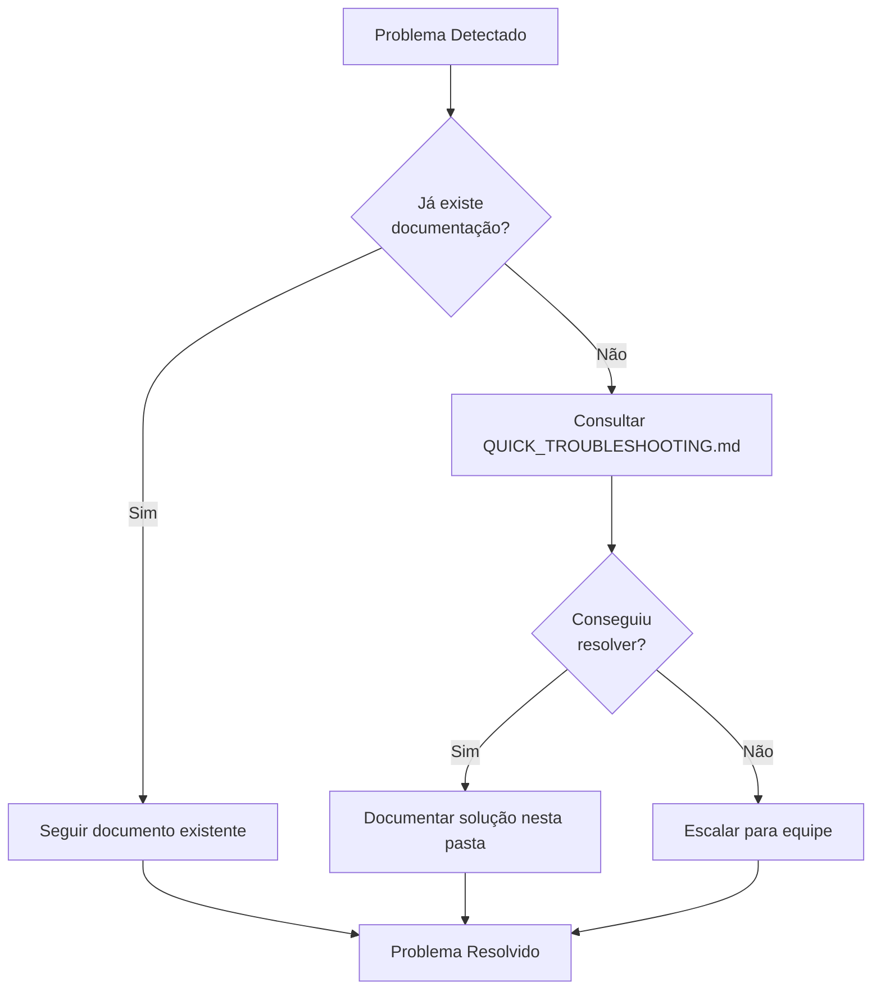

# 📁 Deploy Errors - Documentação de Problemas e Soluções

Esta pasta contém documentação completa de todos os problemas de deploy que ocorreram no projeto e suas soluções.

## 📚 Documentos Disponíveis

### 1. [RAILWAY_API_PREFIX_FIX_2025_10_30.md](./RAILWAY_API_PREFIX_FIX_2025_10_30.md)
**Relatório completo do fix de 30/10/2025**

Documenta em detalhes os 3 problemas principais encontrados:
- Race condition de autenticação
- Contas não criadas automaticamente no Supabase
- Endpoints sem prefixo `/api`

📖 **Leia este documento primeiro** se você encontrar:
- Loading infinito no dashboard
- Erros 404 em múltiplos endpoints
- Usuários logados mas sem dados

### 2. [QUICK_TROUBLESHOOTING.md](./QUICK_TROUBLESHOOTING.md)
**Guia rápido de diagnóstico por sintoma**

Diagnóstico rápido para:
- Skeleton loaders infinitos
- Erros 404
- Problemas de autenticação
- Deployment failing
- Backend 500 errors

⚡ **Use este documento** quando precisar de uma solução rápida (5-15 minutos).

### 3. [PR_CHECKLIST.md](./PR_CHECKLIST.md)
**Checklist completo para Pull Requests e Merges**

Inclui:
- Verificações antes de criar PR
- Checklist para code review
- Ações após merge para main
- Como fazer rollback
- Template de PR

✅ **Execute este checklist** antes de criar qualquer PR ou fazer merge.

---

## 🛠️ Scripts Utilitários

### [`scripts/pre-pr-check.sh`](./scripts/pre-pr-check.sh)
Script automatizado que verifica:
- Endpoints sem `/api` prefix
- Prefixo `/api` duplicado
- Auth guards sem `isLoading`
- console.log/debugger esquecidos
- Testes passando
- TypeScript sem erros
- Linter limpo

**Uso:**
```bash
./deploy-errors/scripts/pre-pr-check.sh
```

### [`scripts/smoke-test.sh`](./scripts/smoke-test.sh)
Testa endpoints principais após deploy:
- Backend health check
- Composio integration
- Billing endpoints
- Frontend loading
- Auth endpoints

**Uso:**
```bash
./deploy-errors/scripts/smoke-test.sh
```

---

## 📋 Documentos Históricos

### Outros Fixes de Railway:

#### RAILWAY_AUTH_FIX_REPORT.md
Fix de login loop causado por httpOnly cookies

#### RAILWAY_LOGIN_FIX.md
Implementação de `/api/auth/session` bridge API para resolver problemas de autenticação

#### RAILWAY_WORKER_FIX.md
Fix de ENV_MODE mismatch no worker que causava agent runs pararem

#### RAILWAY_DEPLOYMENT.md
Configuração geral do deploy no Railway

---

## 🚀 Fluxo de Trabalho Recomendado

### Antes de Criar um PR:

```bash
# 1. Rodar verificações automáticas
./deploy-errors/scripts/pre-pr-check.sh

# 2. Se passar, criar PR
git push origin feature/minha-feature
gh pr create

# 3. Preencher checklist do PR usando template em PR_CHECKLIST.md
```

### Após Merge para Main:

```bash
# 1. Monitorar deployment
railway logs --service backend -f
railway logs --service frontend -f

# 2. Quando deploy completar, rodar smoke tests
./deploy-errors/scripts/smoke-test.sh

# 3. Se falhar, consultar QUICK_TROUBLESHOOTING.md
```

### Se Encontrar um Problema:



---

## 🔍 Como Procurar por Problemas Similares

### 1. Por Sintoma:

```bash
# Buscar em todos os documentos
grep -r "skeleton loader" deploy-errors/
grep -r "404 error" deploy-errors/
grep -r "race condition" deploy-errors/
```

### 2. Por Componente:

```bash
# Backend
grep -r "backend" deploy-errors/ | grep -i error

# Frontend
grep -r "frontend" deploy-errors/ | grep -i error

# Auth
grep -r "auth\|authentication" deploy-errors/ | grep -i error
```

### 3. Por Data:

```bash
# Listar por data de modificação
ls -lt deploy-errors/*.md
```

---

## 📝 Como Adicionar Nova Documentação

Quando resolver um novo problema de deploy:

1. **Criar documento detalhado:**
   ```bash
   # Formato: RAILWAY_<PROBLEMA>_FIX_YYYY_MM_DD.md
   touch deploy-errors/RAILWAY_NOVO_PROBLEMA_FIX_2025_11_15.md
   ```

2. **Estrutura do documento:**
   ```markdown
   # Railway <Nome do Problema> Fix - DD de Mês de YYYY

   ## Resumo Executivo
   [Descrição curta do problema]

   ## Problema Identificado
   [Descrição detalhada]

   ## Causa Raiz
   [Por que aconteceu]

   ## Solução Aplicada
   [O que foi feito]

   ## Como Prevenir no Futuro
   [Medidas preventivas]

   ## Verificação
   [Como verificar se está resolvido]
   ```

3. **Atualizar este README:**
   Adicionar link para o novo documento na seção "Documentos Disponíveis"

4. **Se necessário, atualizar:**
   - `QUICK_TROUBLESHOOTING.md` com novo caso
   - `PR_CHECKLIST.md` com nova verificação
   - Scripts em `scripts/` com novas validações

---

## 📊 Estatísticas de Problemas

| Tipo de Problema | Ocorrências | Tempo Médio de Fix | Prevenível? |
|------------------|-------------|-------------------|-------------|
| Endpoints sem /api | 1 vez | 1-2 horas | ✅ Sim - Pre-commit hook |
| Race conditions | 1 vez | 30 minutos | ✅ Sim - Linting rule |
| Contas não criadas | 1 vez | 15 minutos | ⚠️ Parcial - Monitoring |
| Auth loops | 1 vez | 2 horas | ✅ Sim - Testes E2E |
| ENV mismatch | 1 vez | 1 hora | ✅ Sim - Config validation |

---

## 🎯 Objetivos desta Documentação

### ✅ Completado:
- [x] Documentar todos os problemas de deploy
- [x] Criar guias de troubleshooting
- [x] Fornecer scripts de verificação
- [x] Criar checklists para PRs

### 🔄 Em Progresso:
- [ ] Implementar pre-commit hooks
- [ ] Adicionar testes E2E
- [ ] Criar dashboard de monitoring

### 📅 Futuro:
- [ ] Automatizar mais verificações
- [ ] Integrar com CI/CD
- [ ] Criar alertas proativos

---

## 🤝 Contribuindo

Ao resolver um problema novo:

1. **Documente** - Crie um relatório detalhado
2. **Previna** - Adicione verificação nos scripts
3. **Compartilhe** - Atualize este README
4. **Automatize** - Se possível, crie teste automatizado

---

## 📞 Contatos

Se você encontrar um problema não documentado ou tiver dúvidas:

1. **Primeiro:** Consulte `QUICK_TROUBLESHOOTING.md`
2. **Depois:** Procure em documentos similares
3. **Se não encontrar:** Documente e peça ajuda

---

## 🔗 Links Úteis

- [Railway Dashboard](https://railway.app/project/ac7acd0f-9af5-4a0a-a7a3-093936e37e50)
- [Supabase Dashboard](https://supabase.com/dashboard/project/qupamuozvmiewijkvxws)
- [GitHub Repository](https://github.com/guilhermexp/suna.new)
- [Frontend Production](https://frontend-production-410a.up.railway.app)
- [Backend Production](https://backend-production-bda1.up.railway.app)

---

**Última Atualização:** 30 de Outubro de 2025
**Mantenedor:** Equipe de Desenvolvimento
**Versão:** 1.0
